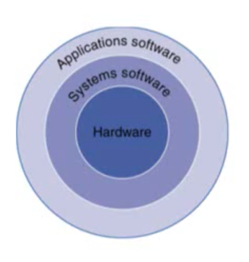
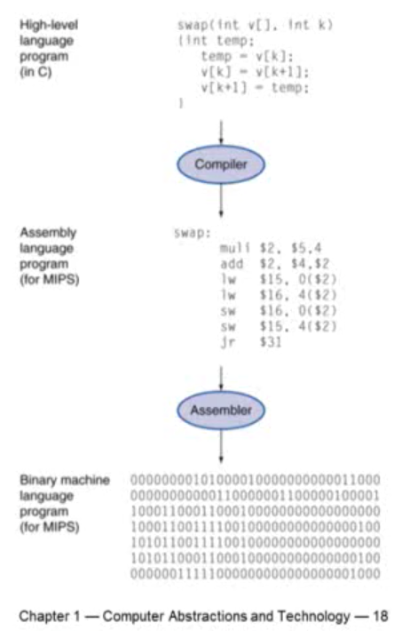

> 본 글은 영남대학교 최규상 교수님의 [컴퓨터 구조](http://www.kocw.net/home/cview.do?cid=184062fa9a833237) 강의를 듣고 작성된 글입니다.

### 1.1 Introduction

컴퓨터 기술은 [무어의 법칙(Moore's Law)](https://ko.wikipedia.org/wiki/%EB%AC%B4%EC%96%B4%EC%9D%98_%EB%B2%95%EC%B9%99)에 따라 급격하게 발전해왔다. 이렇게 급격한 발전한 컴퓨터 기술에 의해서 다양한 어플리케이션이 가능하게 되었다.

> 무어의 법칙: 반도체 직접회로의 성능이 24개월마다 2배로 증가한다는 법칙. 실제로는 2배보다 더 빠르게 늘어왔음.

- 컴퓨터의 종류에는 개인 컴퓨터, 서버 컴퓨터, 슈퍼 컴퓨터, 임베디드 컴퓨터가 있다
	- 개인 컴퓨터
		- 우리가 흔히 사용하는 컴퓨터이다.
		- 일반적인 목적으로 사용되고 가성비에 민감하다.
	- 서버 컴퓨터
		- High capacity, performance, reliability
	- 슈퍼 컴퓨터
		- 아주 특수한 목적(High-end scientific and engineering calculations)에 사용되는 컴퓨터.
		- 우리나라에서는 기상청, 국방연구소 등에서 사용하고 있다.
	- 임베디드 컴퓨터
		- 임베디드는 '내장된'이라는 의미를 가진다. 즉, 큰 시스템에 컴퓨터가 하나의 컴포넌트로 이루어져있는 것을 말한다.
		- 전력소모가 적고, 저성능, 저비용의 특징을 가진다.

```
앞으로 자주 사용하게 될 바이트의 단위에 대해서 공부하고 넘어가도록 하자.
Kilobyte: 1,024 bytes(2^10 bytes)
Megabyte: 1,048,576 bytes(2^20 bytes)
Gigabyte: 1,073,741,824 bytes(2^30 bytes)
Terabyte: 1,099,511,627,776 bytes(2^40 bytes)
Petabyte: 1024 terabytes(2^50 bytes)
Exabyte: 1024 petabytes(2^60 bytes)
```

- PostPC 시대
	- Personal Mobile Device(PMD)
		- 배터리로 동작한다.
		- 인터넷에 연결되어 있다.
		- 스마트폰, 테블릿 피시, electronic glasses 등이 있다,
	- Cloud computing
		- Warehouse Scale Computers(WSC)
		- 서버 팜에서 우리가 필요한 만큼 할당받아서 사용할 수 있다.
		- Software as a Service(SaaS): 내가 필요한 소프트웨어를 서비스로 제공받을 수 있다.
		- 내가 사용하는 소프트웨어의 일부분은 PMD에서 실행되고 나머지 중요한 부분은 Cloud에서 실행된다.
		- AWS, AZURE 등이 있다.

- 우리가 이번 챕터에서 배울 내용은 다음과 같다.
	- 프로그램이 어떻게 머신 랭기지로 바뀔 것인가. 즉, 어떻게 하드웨어가 명령들을 실행할 것인가.
	- The hardware/software interface
	- performance의 정의
	- 하드웨어 디자이너들은 어떻게 성능을 향상시키는가
	- parallel processing은 무엇인가

- 성능?
	- 알고리즘에서 성능
		- operation의 수로 결정된다.
	- Programming language, compiler, architecture에서 성능
		- machine instructions의 수로 결정된다.
	- 프로세서와 메모리 시스템에서 성능
		- 얼마나 명령어를 빨리 실행할 것인가
	- I/O 시스템(OS 포함)에서 성능
		- I/O operations의 수로 결정된다.

### 1.2 Eight Great Ideas in Computer Architecture

1. Design for Moore's Law
2. Use abstraction to simplify design
3. Make the common case fast
4. Performance via parallelism
5. Performance via pipelining
6. Performance via prediction
7. Hierarchy of memories
8. Dependability via redundancy

여기 나와 있는 8가지 아이디어들이 컴퓨터 성능 향상에 지대한 역할을 함!

### 1.3 Below your program...



- 프로그램 밑에...
	- Application Software
		- Written in high-level language
		- 파워포인트, 웹 브라우저 등
	- System software
		- Compiler: translates HLL code to machine code
		- Operating System: service code
			- Handling input/output
			- Managing memory and storage
			- Scheduling tasks & sharing resources
	- Hardware
		- Processor, memory, I/O controllers

- Levels of Program Code
	- High-level language
		- Level of abstraction closer to problem domain
		- Provides for productivity and portability
	- Assembly language
		- Textual representation of instructions
	- Hardware representation
		- Binary digits
		- Encoded instructions and data



### 1.4 Under the Covers

- 대부분의 컴퓨터들은 비슷한 구성요소를 가지고 있다
	- 입/출력 장치
		- 유저 인터페이스 장치
			- 디스플레이, 키보드, 마우스, 터치 스크린 등
		- 저장 장치
			- 하드디스크, 시디 등
		- 네트워크 어댑터
			- 다른 컴퓨터와 통신하기위해 필요

- 프로세서(CPU) 내부에는
	1. 데이터 패스
		- 데이터가 어떻게 연산되는지 
	2. 컨트롤
		- 프로세서에 있는 다양한 컴포넌트들을 컨트롤 하는 것
	3. 캐시 메모리
		- SRAM으로 구성된 메모리에 자주쓰는 데이터를 올려두는 곳

- 추상화(Abstraction)
	- 아주 복잡한 문제를 단순화해서 쉽게 풀 수 있도록하는 기법
		- ex) Instruction set architecture(ISA): The hardware/software interface
	
- 저장 장치
	- 휘발성 메인 메모리
		- 전원이 꺼지면 데이터들이 지워짐
	- 비휘발성 세컨더리 메모리
		- 마그네틱 디스크
		- 플래시 메모리
		- 옵티컬 디스크

- 네트워크
	- LAN, WAN, 와이파이, 블루투스 등

### 1.5 Technologies for Building Processors and Memory

Electronics technology는 계속 발전해왔다. 용량과 성능은 향상되고 가격은 저렴해졌다. 그 발전 양상은 아래표를 보면 상대적으로 알 수 있다.

|Year|Technology|Relative performance/cost|
|---|---|---|
|1951|진공관|1|
|1965|트랜지스터|35|
|1975|IC(Integrated circuit)|900|
|1995|VLSI(Very large scale IC)|2,400,000|
|2013|Ultra large scale IC|250,000,000,000|

### 1.6 Performance

- Response time
	- 하나의 일을 하는데 소요되는 시간
- Throughput
	- 단위시간당 얼마나 많은 일을 할 수 있는가?

- 더 빠른 CPU로 교체 시?
	- Response time 짧아짐
	- Throughput 증가
- CPU를 추가하면?
	- Response time 그대로
	- Throughput 증가

Response time이 줄어들면 Throughput은 무조건 줄어들지만 Throughput이 줄어든다고해서 Response time이 줄어드는 것은 아니다. 컴퓨터 구조에서 퍼포먼스는 Response time 또는 Throughput으로 이야기하는데, 우리는 Response time에 집중해서 살펴보도록 하겠다.

__Performance = 1/Execution Time__

- `X is n time faster than Y`
	- `Performance X/Performance Y = Execution time Y/Execution time X = n`

- Measuring Execution time
	- Elapsed time(시스템 퍼포먼스를 정의할 때 사용)
		- Total response time, including all aspects
			- Processing, I/O, OS overhead, idle time
	- CPU time
		- Time spent processing a given job
		- user CPU time, system CPU time
		- 프로그램에 따라 CPU나 시스템의 영향이 다를 수 있다.(어떤 프로그램은 CPU 성능, 어떤 프로그램은 I/O의 엉향 다양하게 영향을 미칠 수 있다.)

- CPU Clocking
	- Rising edge to Rising edge = Clock period

- Clock rate(clock cycles per second in MHz or GHz) is inverse of clock cycle time(clock period)
```
CC = 1 / CR
```

