> 본 글은 영남대학교 최규상 교수님의 [컴퓨터 구조](http://www.kocw.net/home/cview.do?cid=184062fa9a833237) 강의를 듣고 작성된 글입니다.

### 2.1 Introduction

- Instruction Set
	- 명령어들의 집합(레퍼토리)이다.
	- 컴퓨터 마다 다른 Instruction Set을 가지지만 많은 공통점을 가지고 있다.
	- 초창기 컴퓨터들은 매우 단순한 Instruction Set을 가지고 있었다.(명령어의 수, 종류가 적었다는 뜻)
	- 많은 최신 컴퓨터(CPU) 또한 simple instruction sets을 가진다.
		- 물론 초창기와 최신 컴퓨터 사이에 complex instruction set을 가지는 컴퓨터도 존재한다.
		- 즉, 단순 -> 복잡 -> 단순의 과정을 거쳐왔다.
	
- Instruction Set Architecture (ISA)
	- 간단히 ISA 또는 아키텍쳐라고 불린다.
	- 하드웨어와 low level software(시스템 소프트웨어, 운영체제) 사이의 인터페이스이다.
	- 명령어, 레지스터, 메모리 접근, I/O 등 기계언어 프로그램을 쓰기위해 필요한 모든 정보를 포함하고 있다.
	- Enables implementations of varying cost and performance to run identical software

- Application Binary Interface (ABI)
	- ISA와 운영체제 인터페이스(operation system interface)를 합친 것이다.
	- ABI에서 어떠한 소프트웨어가 동작한다면 어떤한 머신에서도 동일한 ABI로 소프트웨어를 동작시킬 수 있다.

- The MIPS Instruction Set(MIPS의 Instruction Set에 대해서 배워보자!)
	- MIPS는 우리가 1장에서 배운바와같이 Millions of Instructions Per Second를 의미하기도 하지만 CPU이름이기도 하다.
	- MIPS는 처음 스탠포드에서 제안하였고 MIPS Technologies에서 상용화했다.
	- 임베디드 시장에서 많이 쓰인다.(최근에는 ARM이 많이 쓰이긴 한다.)
	- MIPS에서 사용하는 알고리즘과 특성은 많은 다른 CPU들과 공통점을 가진다.

### 2.2 Operations of the Computer Hardware

- Arithmetic Operations
	- 어셈블리에서 add a, b, c를 실행하면 b와 c를 더해서 a에 할당한다.
	- 모든 산술연산은(Arithmetic)은 다음과 같은 형태를 가진다.

2장에서 4개의 디자인 원칙을 배우게 될 것이다. 먼저 첫 번째 디자인 원칙을 만나보자

#### Design Principle 1: Simplicity favours regularity (Regularity를 사용해서 간단하게 만들어라)

>- 어떤 규칙성을 주면 구현할 때 훨씬 편리하다.
>- 간단하게 만들어야 낮은 cost로 높은 성능을 낼 수 있다.

### 2.3 Operands of the Computer Hardware

- Register Operands
	- Arithmetic Operations는 register operands를 사용한다.
	- MIPS는 32bit 레지스터를 32개 가지고 있다.
		- 이 레지스터에 자주 사용하는 데이터를 로드해서 사용한다.
		- 숫자의 범위는 0 ~ 31 이다.
		- 32비트 데이터를 word라고 부른다.(1word = 32bit)
	- 어셈블리에서는 t로 시작하는 레지스터와 s로 시작하는 레지스터가 있다.
		- $t0, $t1, ..., $t9 for temporary values
		- $s0, $s1, ..., Ss7 for saved variables(우리가 변수에 저장해서 사용하는 값들)

#### Design Principle 2: Smaller is faster

>- c.f. main memory: millions of locations
>	- 메인메모리는 레지스터에 비교하면 훨씬 크다. 그래서 메인메모리에 접근하는 시간이 레지스터에 접근하는 시간보다 훨씬 오래 걸린다.

- Register Operand 예제
	- C code: f = (g + h) - (i + j);
		-f,...,j in $s0,...,$s4
	- Compiled MIPS code:
		```mips
		add $t0, $s1, $s2
		add $t1, $s3, $s4
		sub $s0, $t0, $t1
		```

- Byte Address
	- 8 비트가 유용하기 때문에, 대부분의 컴퓨터의 메모리는 바이트 단위로 주소를 지정한다.
	- Alignment restriction - the memory address of a word must be on natural word boundaries (a multiple of 4 in MIPS-32)
	- Endian: 데이터를 워드에 어떤 방식으로 저장할 것인가를 말하는 것
		- Big Endian: leftmost byte is word address
			- IBM 360/370, Motorola 68k, MIPS, Sparcm HP PA
		- Little Endian: rightmost byte is word address
			- Intel 80x86, DEC Vax, DEC Alpha (Windows NT)

- Memory Operands
	- Main memory used for composite data
		- Arrays, structures, dynamic data
	- To Apply arthmetic operations
		- Load values from memory innto registers
		- Store result from register to memory
	- Memory is byte addressed
		- Each address identifies an 8-bit byte
	- Words are aligned i nmemory
		- Address must be a multiple of 4
	- MIPS is Big Endian
		- Most-significant byte at least address of a word
		- c.f. Little Endian: least-significant byte at least address

- Memory Operand Example 1
	- C code: g = h + A[8];
		- g in $s1, h in $s2 base address of A in $s3
	- Compiled MIPS code:
		- Index 8 requires offset of 32
			- 4 bytes per word
				```mips
				lw  $t0, 32($s3)    # lw: load word
				add $s1, $s2, $t0
				```

- Register vs Memory
	- Registers are faster to access than memory
	- Operating on memory data requires loads and stores (Load-Store Architecture)
		- More instructions to be executed
	- Compiler must use registers for variables as much as possible
		- Only spill to memory for less frequently used variables
		- Register optimization is important!

- 레지스터
	- 메인 메모리보다 빠르다
		- But register files with more locations are slower
		- e.g. a 64 word file could be as much as 50% slower than a 32 word file
		- Read/write port increase impacts speed quadratically
	- 컴파일러가 사용하기 더 쉽다(Easier for a compiler to use)
		- e.g. (A\*B) - (C\*D) - (E\*F) can do multiplies in any order vs stack
	- Can hold variables so that
		- code density improves (since register are named with fewer bits than a memory location. 레지스터의 경우 5bits, 메모리의 경우 32bits)
		- density가 높다? 코드의 직접도가 높다는 것이고 적은 코드로 어떠한 일을 수행할 수 있다는 것. 즉 같은 일을 하더라도 명령의 수가 적다.

- MIPS Register Convention

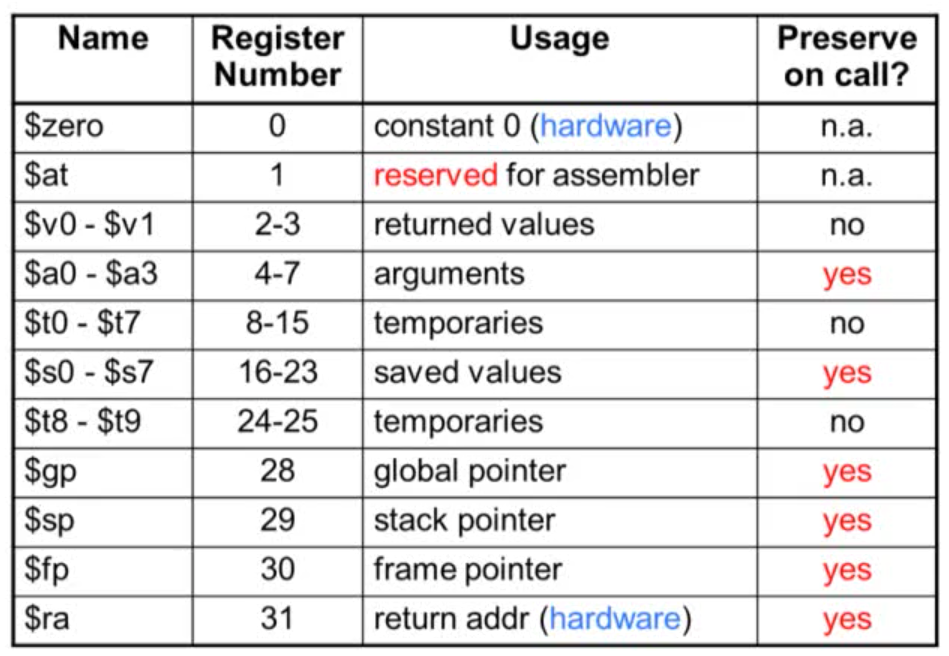

- Immediate Operands
	- Constant data specified in an instruction
		- addi $s3, $s3, 4
	- No subtract immediate instruction
		- Just use a negative constant
		- addi $s2, $s1, -1

#### Design Principle 3: Make the common case fast
>- Small constants are common
>- Immediate operand avoids a load instruction

- The Constant Zero
	- MIPS register 0($zero) is the constant 0
		- Cannot be overwritten
	- Useful for common operations
		- E.g., move between registers
		- add $t2, $s1, $zero

### 2.4 Signed and Unsigned Numbers

- Unsigned Binary Integers
	- Given an n-bit number
		- 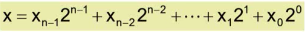
		- Range: 0 to 2^n - 1

- 2s-Complement(2의 보수) Signed Integers
	- Given an n-bit number
		- 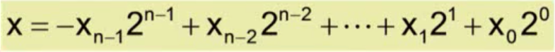
		- Range: -2^(n-1) to 2^(n-1) - 1
	- Bit 31(MSB) is sign bit
		- 1 for negative numbers
		- 0 for non-negative numbers

- Signed Negation
	- Complement and add 1
	- 여기서 Complement란 1 -> 0, 0 -> 1와 같이 바꿔주는 것

- Sign Extension
	- Representing a number using more bits(2진수를 8진수, 32진수와 같이 더큰 진수로 나타내는 것. 그리고 이 때 값과 부호는 유지되어야 한다.)
		- Preserve the numeric value
	- In MIPS instruction set
		- addi: extend immediate value
		- lb, lh: extend loaded byte/halfword
		- beq, bne: extend the displacement
	- Replicate the sign bit to the left
		- c.f. unsigned values: extend with 0s
	- Examples: 8-bit to 16-bit
		- +2: 0000 0010 => 0000 0000 0000 0010
		- -2: 1111 1110 => 1111 1111 1111 1110

### 2.5 Representing Instructions in the Computer

- Representing Instructions
	- Instructions are encoded in binary
		- Called machine code
	- MIPS instructions
		- Encoded as 32-bit instruction words
		- Small number of formats encoding operationn code (opcode), register numbers, ...
		- Regularity!(이전에 이야기했던 디자인 원칙 1에 해당)
	- Register numbers
		- $t0 - $t7 are reg's 8 - 15
		- $t8 - $t9 are reg's 24 - 25
		- $s0 - $s7 are reg's 16 - 23

- MIPS R-format Instructions
	- 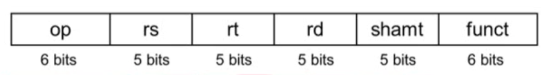
	- Instruction fields
		- op: operation code (opcode)
		- rs: first source register number
		- rt: second source register number
		- rd: destination register number
		- shamt: shift amount (00000 for now)
		- funct: function code (extends opcode)
	- Example
		- 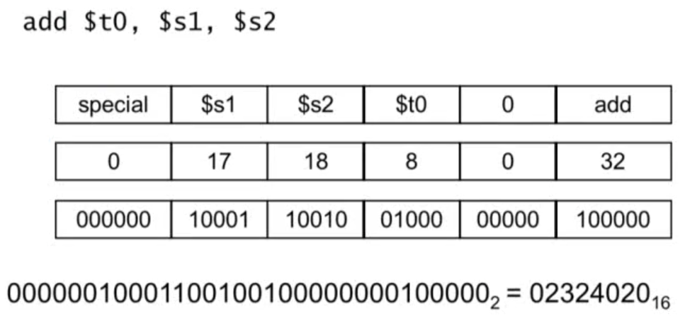

- Hexadecimal
	- Base 16
		- Compact representation of bit strings
		- 4 bits per hex digit

- MIPS I-format Instructions
	- 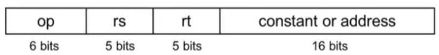
	- Immediate arithmetic and load/store instructions
		- rt: destination or source register number
		- Constant: -2^15 to +2^15 - 1
		- Address: offset added to base address in rs

#### Design Principle 4: Good design demands good compromises

>- Different formats complicate decoding, but allow 320bit instructions uniformly
>- Keep formats as similar as possible
>- MIPS I-format instructions를 살펴보면 Immediate arithmetic 과 load/store instructions는 서로 다른 명령이지만 같은 포맷을 가진다. 이것이 바로 good compromises.

- Stored Program Computers
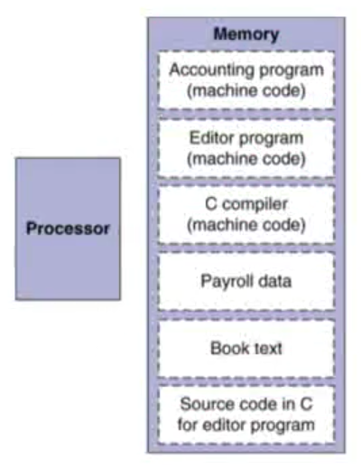 
	- Instructions represented in binary, just like data
	- Instructions and data stored in memory
	- Programs can operate on programs
		- e.g., compilers, linkers, ...
	- Binary comptibility allows compiled programs to work on different computers
		- 표준화된 ISA가 지원되면 가능하다.(Standardized ISAs)

### 2.6 Logical Operations

- Logical Operations(논리 연산)
	- Instructions for bitwise manipulation 

	|Operation|C|Java|MIPS|
	|---|---|---|---|
	|Shift left|<<|<<|sll|
	|Shift right|>>|>>>|srl|
	|Bitwise AND|&|&|and, andi|
	|Bitwise OR|\||\||or, ori|
	|Bitwise NOT|~|~|nor|

	- Useful for extracting and inserting groups of bits in a word

- Shift Operations

	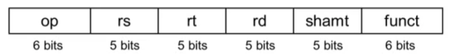

	- shamt: how many positions to shift
	- Shift left logical
		- Shift left and fill whit 0 bits
		- sll bt i bits multiplies by 2^i
	- Shift right logical
		- Shift right and fill with 0 bits
		- srl by i bits divides by 2^i (unsigned only)

- AND Operations
	- Useful to mask bits in a word
		- Select some bits, clear others to 0

- OR Operations
	- Useful to include bits in a word
		- Set some bits to 1, leave others unchanged

- NOT Operations
	- Useful to innvert bits in a word
		- Change 0 to 1, and 1 to 0
	- MIPS has NOR 3-operand instruction
		- a NOR b == NOT (a OR b)

### 2.7 Instructions for Making Decisions

- Conditional Operations
	- Branch to a labeled instruction if a condition is true
		- Otherwise, continue sequentially
	- beq rs, rt, L1
		- if (rs == rt) branch to instruction labeled L1;
	- bne rsm rtm L1
		- if (rs != rt) branch to instruction labeled L1;
	- j L1
		- unconditional jump to instruction labeled L1

- Compiling If Statements
	- C code
		```c
		if (i==j) f = gh;
		else f = g-h;
		```
		- f, g, ... in $s0, $s1, ...
	- Compiled MIPS code
		```mips
			bne $s3, $s4, Else
			add $s0, $s1, $s2
			j Exit
		Else: sub $s0, $s1, $s2
		Exit: ... <- Assembler calculates addresses
		```

- Compiling Loop Statements
	- C code
		```c
		while (save[i] == k) i += 1;
		```
		- i in $s3, k in $s5, address of save in $s6
	- Compiled MIPS code
		```mips
		Loop: sll $t1, $s3, 2
			add $t1, $t1, $s6
			lw $t0, 0($t1)
			bne $t0, $s5, Exit
			addi $s3, $s3, 1
			j Loop
		Exit: ...
		```

- Basic Blocks
	- A basic block is a sequence of instructios with
		- No embedded branches (except at end)
		- No branch targets (except at beginning)

		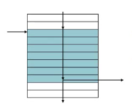

		- A compiler identifies basci blocks for optimization
		- An advanced processor can accelerate execution of basic blocks

- More Conditional Operations
	- Set result to 1 if a condition is true
		- Otherwise, set to 0
	- slt rd, rs, rt
		- if(rs\<rt) rd = 1; else rd = 0;
	- slti rt, rs ,constant
		- if(rs\<constant) rt = 1; else rt = 0;
	- Use in combination with beq, bne
		```mips
		slt $t0, $s1, $s2 # if ($s1 < $s2)
		bne $t0, $zero, L # branch to L
		```

- Branch Instruction Design
	- Why not blt, bge, etc?
	- Hardware for <, >=, ... slower than =, !=
		- Combining with branch involves more work per instruction, requiring a slower clock(clock period)
		- All instructions penalized!
	- beq and bne are the common case
	- This is good design compromise

- Signend vs Unsigned
	- Siged comparison: slt, slti\
	- Unsigned comparison: sltu, sltui

### 2.8 Supporting Procedures in Computer Hardware

- Six Steps in Execution of a Procedure(프로시져 또는 함수)
	1. Main routine (caller: 호출하는 함수) places parameters in a place where the procedure (callee: 호출당하는 함수) can access them(caller는 callee가 접근할 수 있는 곳에 매개변수를 위치시킨다.)
		- $a0 - $a3: four argument registers
	2. Caller는 calllee에게 control을 넘긴다.(callee가 실행된다.)
	3. Callee는 필요한 저장공간(메모리)를 할당 받는다.
	4. Callee는 해야할 일을 수행한다.
	5. 할 일을 모두 마친 Callee는 결과값(return 값)을 caller가 접근할 수 있는 곳에 위치시킨다.
		- $v0 - $v1: two value registers for result values
	6. Callee가 caller에게 control을 넘긴다.
		- $ra: one return address register to return to the point of origin

- Register Usage
	- $a0 - $a3: arguments(reg's 4 - 7)
	- $v0, $v1: result values(reg's 2 and 3)
	- $t0 - $t9: temporaries
		- Can be overwritten by callee
	- $s0 - $s7: saved
		- Must be saved/restored by callee
	- $gp: global pointer for static data(reg 28)
	- $sp: stack pointer(reg 29)
	- $fp: frame pointer(reg 30)
	- $ra: return address(reg 31)

- Procedure Call Instructions
	- Procedure call: jump and link
		- jal ProcedureLabel
		- Address of following instruction put in $ra
		- Jumps to target address
	- Procedure return: jump register
		- jr $ra
		- Copies $ra to program counter (program counter란? 줄여서 pc라고도 불림, 현재 실행하고있는 명령어의 메모리 주소를 가리키는 레지스터)
		- Can also be used for computed jumps
			 - e.g., for case/switch statements

- Leaf Procedure Example (Leaf Procedure: 함수(프로시져) 내부에서 다른 함수(프로시져)를 호출 하지 않는 함수(프로시져))
	- C code
		```c
		int leaf_example (int g, h, i, j){
			int f;
			f = (g + h) - (i + j);
			return f;
		}
		```
	- Arguments g, ..., j in $a0, ..., $a3
	- f in $s0 (hence, need to save $s0 on stack)
	- Result in $v0
	- MIPS code
		```mips
		leaf_example:
		# Save $s0 on stack
		addi $sp, $sp, -4
		sw $s0, 0($sp) # 기존에 있을지 모르는 $s0 값을 스택 포인터에 저장
		# Procedure body
		add $t0, $a0, $a1
		add $t1, $a2, $a3
		sub $s0, $t0, $t1
		# Result
		add $v0, $s0, $zero # move 명령어와 같은 결과(add + $zero)
		# Restore $s0
		lw $s0, 0($sp) # 위에서 저장한 값 복구
		addi $sp, $sp, 4
		# Return
		jr $ra
		```

- Non-Leaf Procedures
	- Procedures that call other procedures
	- For nested call, caller needs to save on the stack:
		- Its return address
		- Any arguments and temporaries needed after the call
	- Restore from the stack after the call

- Non-Leaf Procedure Example
	- C code
		```c
		int fact (int n){
			if (n < 1) return f;
			else return n * fact(n - 1); 
		}
		```
		- Argument n in $a0
		- Result in $v0
	- MIPS code
		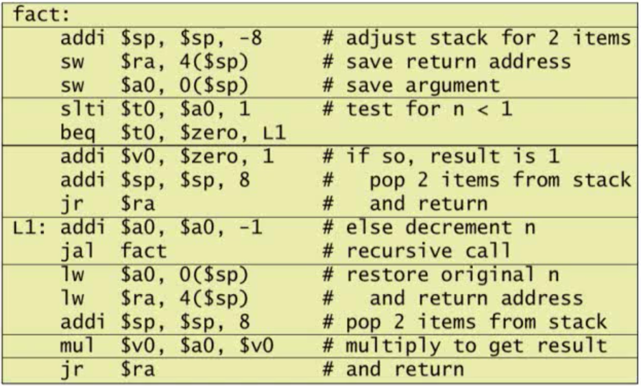

- Local Data on the Stack
	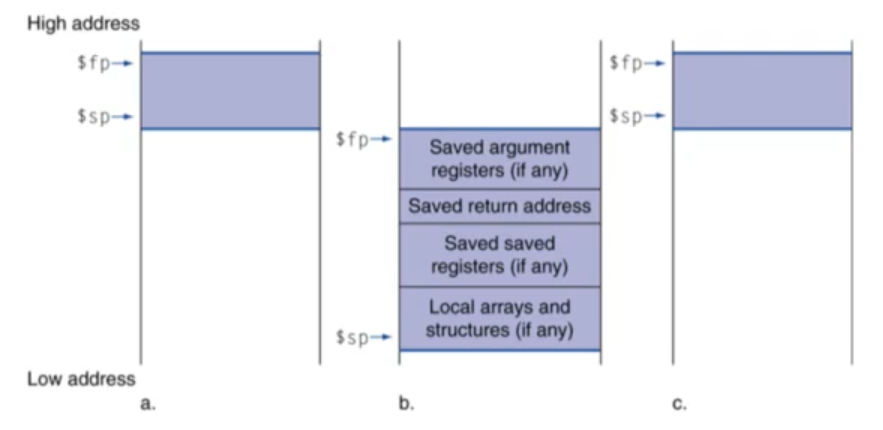
	- Local data allocated by callee
		- e.g., C automatic variables
	- Procedure frame (activation record) (그림에서 보라색으로 칠해진 영역)
		- Used by some compilers to manage stack storage

- Memory Layout
	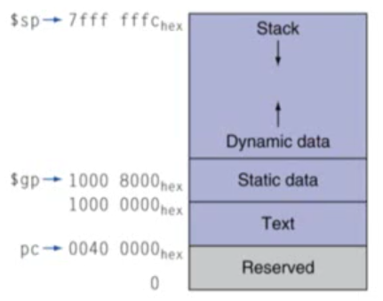
	- Text program code
	- Static data: global variables
		- e.g., static variables in C, constant arrays and strings
		- $gp initialized to address allowing +-offsets into this segment
	- Dynamic data: heap
		- E.g., malloc in C, new in Java
	- Stack: automatic storage
	- 우리가 코딩하다가 stackoverflow를 만나게 되는 경우? stack이 계속 쌓여 나가다가 dynamic data 영역을 침범하게 될 때
	- $gp의 역햘: 여기서 static data의 중앙값을 가지지만 그 값은 프로세서에 따라 다를 수 있다. 하지만 그 목적(역할)은 static data에 수월하게 접근하기 위한 것으로 동일하다.

### 2.9 Communicating with People

- Character Data
	- Byte-encoded character sets (1 byte로 표현)
		- ASCII: 128 characters
			- 95 graphic, 33 control
		- Latin-1: 256 characters
			- ASCII, +96 more graphic characters
	- Unicode: 32-bit character set
		- Used in Java, C++ wide characters, ...
		- Most of the world's alphabets, plus symbols
		- UTF-8, UTF-16: variable-length encodings(1 byte 이상의 값으로 표현)

- Byte/Halfword Operations
	- Could use bitwise operations
	- MIPS byte/halfword load/store
		- String processing is a common case
			```mips
			lb rt, offset(rs)	lh rt, offset(rs)
			```
		- Sign extend to 32 bits in rt
			```mips
			lbu rt, offset(rs)	lhu rt, offset(rs)
			```
		- Zero extend to 32 bits in rt
			```mips
			sb rt, offset(rs)	sh rt, offset(rs)
			```
		- Store just rightmost byte/halfword

- String Copy Example
	- C code
		- Null-terminated string
		```c
		void strcpy (char x[], char y[]){
			int i;
			i = 0;
			while((x[i]=y[i]) != '\0')
				i += 1;
		}
		```
		- Addresses of x, y in $a0, $a1
		- i in $s0
	- MIPS code
		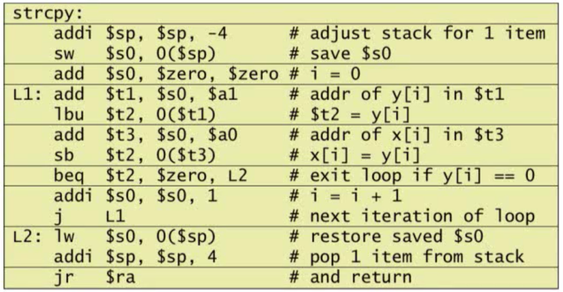

### 2.10 MIPS Addressing for 32-Bit Immediates and Addresses

- 32-bit Constants
	- Most constants are small
		- 16-bit immediate is sufficient
	- For the occasional 32-bit-constant
		```mips
		lhi rt, constant
		```
		- Copies 16-bit constant to left 16 bits of rt
		- Clears right 16 bits of rt to 0
		```mips
		lhi $s0, 61
		ori $s0, $s0, 2304
		# 이와같이 두 개의 명령어를 사용해서 32bit 상수를 만들 수 있다.
		```

- Branch Addressing
	- Branch instruction specify
		- Opcode, two registers, target address
		- Most branch targets are near branch
			- Foward or backward
		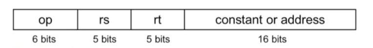
		- PC(Program Counter)-relative addressing
			- Target address = PC + offset x 4
			- PC already incremented by 4 by this time

- Jump Addressing
	- Jump (j and jal) targets could be anywhere in text segment
		- Encode full address in instruction
		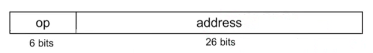
	- (Pseudo)Direct jump addressing
		- Target address = PC31...28 : (address x 4)

- Branching Far Away
	- If branch target is too far to encode with 16-bit offset, assembler rewrites code

- Addressing Mode Summary
	1. Immediate addressing ex) addi
	2. Register addressing ex) R-type
	3. Base addressing ex) lw/sw
	4. PC-relative addressing ex) branch
	5. Pseudodirect addressing ex) jump

### 2.11 Parallelism and Instruction: Synchronization

- Synchronization
	- Two processors sharing an area of memory
		- P1 writes, then P2 reads
		- Data race if P1 and P2 don't synchronnize
			- Result depends of order of access
	- Hardware support required
		- Atomic read/write meomory operation (어떤 오퍼레이션을 할 때 중간에 interrupt가 일어나지 않는 것)
		- No other access to the location allowed between the read and write
	- Could be a single instruction
		- E.g., atomic swap of register <-> memory
		- Or an atomic pair of instructions

- Synchronization in MIPS
	- Load linked: ll rt, offset(rs)
	- Store conditional: sc rt, offset(rs)
		- Succeeds if location not changed since the ll
			- Returns 1 in rt
		- Fails if locationn is changed
			- Returns 0 in rt

### 2.12 Translating and Starting a Program

- Translation and Startup
	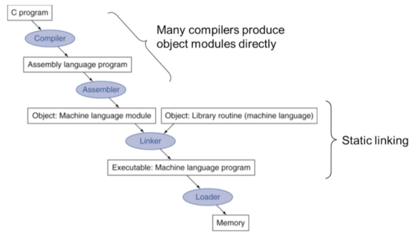

- Assembler Pseudoinstructions
	- Most assembler instructions represent machine instructions one-to-one
	- Pseudoinstructions: figments of the assembler's imagination
	- MIPS 어셈블러에는 수두인스트럭션이 존재한다. 실제 MIPS에는 존재하지 않는 명령어지만 MIPS에서 사용할 수 있는 가짜 명령어. 이런 경우 어셈블러가 해당되는 실제 MIPS 명령어로 바꿔준다. ex) move

- Producing an Object Module
	- Assembler(or compiler) translates program into machine instructions
	- Provides information for building a complete program from the pieces
		- Header: described contents of object module
		- Text segment: translated instructions
		- Static data segment: data allocated for the life of the program
		- Relocation info: for contents that depend on absolute location of loaded program
		- Symbol table: global definitions and external refs
		- Debug info: for associating with source code

- Linking Object Modules
	- Produces an executable image
		1. Merges segments
		2. Resolve labels (determine their addresses)
		3. Patch location-dependent and external refs
	- Could leave location dependencies for fixing by a relocating loader
		- But with virtual memory, no need to do this
		- Program can be loaded into absolute location in virtual memory space
		- virtual memory에 있는 절대 주소값을 사용하면 된다는 것(?)

- Load a Program
	- Load from image file on disk into memory
		1. Read header to determine segment size
		2. Create virtual address space
		3. Copy text and intialized data into memory
			- Or set page table entries so they can be faulted in
		4. Set up arguments on stack
		5. Initialize registers (including $sp, $fp, $gp)
		6. Jump to startup routine
			- Copies arguments to $a0, ... and calls main
			- When main returns, do exit syscall

- Dynamic Linking
	- Only link/load library procedure when it is called
		- Requires procedure code to be relocatable
		- Avoids image bloat caused by static linking of all (transitively) referenced libraries
		- Automatically picks up new library versions
- Lazy Linkage
	

### 2.13 A C Sort Example to Put it All Together

- C Sort Example
	- Illustrates use of assembly instructionns for a C bubble sort function
	- Swap procedure (leaf)
		```c
		void swap(int v[], it k){
			int temp;
			temp = v[k];
			v[k] = v[k+1];
			v[k+1] = temp;
		}
		```
		- v in $a0, k in $a1, temp i $t0

		- In MIPS...
			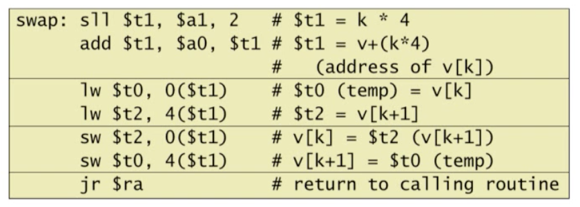
	- The Sort Procedure in C
		- Non-leaf(calls swap)
			```c
			void sort (int v[], int n){
				int i, j;
				for(i = 0; i < n; i += 1) {
					for(
						j = i - 1,
						j >= 0 && v[j] > v[j+1];
					){
						swap(v, j);
					}
				}
			}
			```
			- v in $a0, k in $a1, i in $s0,j in $s1
			- In MIPS...
				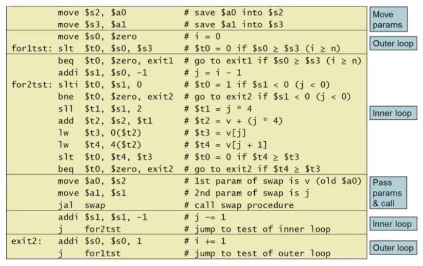
		- The Full Procedure
			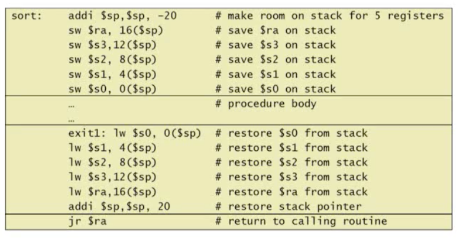

- Effect of Compiler Optimization
	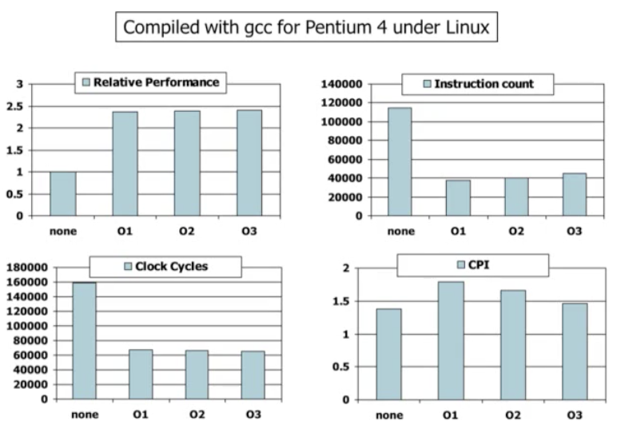

- Compiler Benefits
	- Comparing performance for bubble sort

	|gcc opt|Relative performance|Clock cycles(M)|Instr cout(M)|CPI|
	|---|---|---|---|---|
	|None|1.00|158,615|114,938|1.38|
	|O1(medium)|2.37|66,990|37,470|1.79|
	|O2(full)|2.38|66,521|39,993|1.66|
	|O3(proc mig)|2.41|65,747|44,993|1.46|

	- O3가 명령어 수는 O1, O2에 비해 많지만 CPI가 제일 낮아 성능이 제일 좋다.

- Lessons Learnt
	- 명령어 수와 CPI 각각으로는 성능의 좋은 지표가 될 수 없다.
	- Compiler optimization are sensitive to the algorithm
	- Java/JIT compiled code is significantly faster than JVM interpreted
		- Comparable to optimized C in some cases
	- Nothing can fix a dumb algorithm!

### 2.14 Arrays versus Pointers

- Arrays vs Pointers
	- Array indexing involves
		- Multiplying index by element size
		- Adding to array base address
	- Pointers correspond directly to memory addresses
		- Can avoid indexing complexity

- Example: Clearing and Array
	
	- 예제에서 명령어 줄 수는 같지만 loop의 줄 수를 살펴보면 array의 경우는 6줄, pointer의 경우는 4줄이다. 따라서 반복 횟수가 많아질 수 록 pointer로 구현하는 것이 성능이 더 좋다.

- Comparison of Array vs Ptr
	- Multiply "strength reduced" to shift
	- Array version requires shift to be inside loop
		- Part of index calculation for incremented!
		- c.f. incrementing pointer
	- Compiler can achieve same effect as manual use of pointers
		- Induction variable elimination
		- Better to make program clearer and safer
	- 결론: 컴파일러가 배열을 사용하더라도 포인터를 사용하는 것과 유사한 효과를 준다. 또한 포인터를 사용할 경우 프로그램을 이해하기 까다롭고 배열을 사용하는게 더 이해하기쉽고 버그가 적게 생기므로 배열을 사용하자.

### 2.16 Real Stuff: ARM Instructions

- ARM & MIPS Similarities

	- ARM: the most popular embedded core
	- Similar basic set of instructions to MIPS

	||ARM|MIPS|
	|---|---|---|
	|Data announced|1985|1985|
	|Instruction size|32 bits|32 bits|
	|Address space|32-bit flat|32-bit flat|
	|Data alignment|Aligned|Aligned|
	|Data addressing modes|9|3|
	|Registers|15 * 32-bit|31 * 32-bit|
	|I/O|Memory mapped|Memory mapped|

- Compare and Branch in ARM
	- Uses condition codes for result of an arithmetic/logical instruction
		- Negative, zero, carry, overflow
		- Compare instructions to set condition codes without keeping the result
	- Each instruction can be conditional
		- Top 4 bits of instruction word: condition value
		- Can avoid branches over single instructions

- Instruction Encodeing
	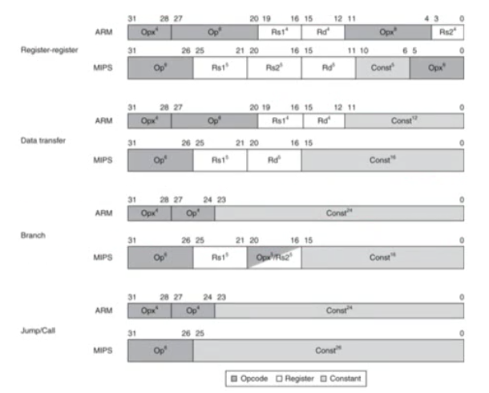

### 2.17 Real Stuff: x86 Instructions (Intel)

- CISC (Complex Instruction Set Computer)

- Complex instruction set makes implementation difficult
	- Hardware translates Instruction to simpler microoperations
		- Simple instructions: 1-1
		- Complex instructions: 1-many
	- Microengine similar to RISC
	- Market share makes this economically viable
- Comparable performance to RISC
	- Compilers avoid complex instructions

### 2.18 Real Stuff: ARM v8 (64-bit) Instructions

- In moving to 64-bit, ARM did a complete overhaul
- ARM v8 resembles MIPS
	- Changes from v7:
		- No conditional execution field
		- Immediate fields is 12-bit constant
		- Dropped load/store multiple
		- PC is no longer a GPR
		- GPR set expanded to 32
		- Addressing modes work for all word size
		- Divide instruction
		- Branch if equal/branch if not equal instructions

### 2.19 Fallacies and Pitfalls

#### Fallacies

- Powerful instruction -> higher performance
	- Fewer instructions required
	- But complex instructions are hard to implement
	- Compilers are good at making fast code from simple instructions

- Use assembly code for high performance
	- But modern compilers are better at dealing with mordern processors
	- More lines of code -> more errors and less productivity

- Backward compatibility -> instruction set doesn't change
	- But they do accrete more instructions

#### Pitfalls

- Sequentail words are not at sequential addresses
	- Increment by 4, not by 1!

- Keeping a pointer to an automatic variable after procedure returns
	- e.g., passing pointer back via an argument
	- Pointer becomes invalid when stack popped

### 2.20 Concluding Remarks

- Design principles
	1. Simplicity favors regularity
	2. Smaller is faster
	3. Make the common casse fast
	4. Good design demands good compromises

- Layers of software/hardware
	- Compiler, assembler, hardware

- MIPS: typical of RISC ISAs
	- c.f. x86
