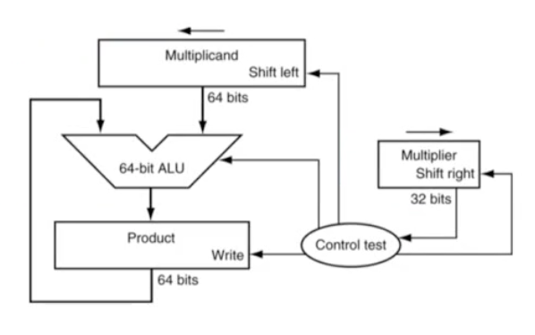
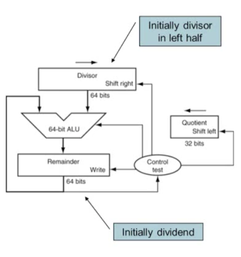

> 본 글은 영남대학교 최규상 교수님의 [컴퓨터 구조](http://www.kocw.net/home/cview.do?cid=184062fa9a833237) 강의를 듣고 작성된 글입니다.

### 3.1 Introduction

### 3.2 Addition and Subtraction

- Integer Addition
	- Overflow if result out of range
		- Adding +ve and -ve operands, no overflow
		- Adding two +ve operands
			- Overflow if result sign is 1
		- Adding tow -ve operands
			-Overflow if result sign is 0

- Integer Subtraction
	- Add negation of second operand
	- Overflow is result out of range
		- Subtracting two +ve or two -ve operands, no overflow
		- Subtracting +ve from -ve operand
			- Overflow if result sign is 0
		- Subtracting -ve from +ve operand
			- Overflow if result sign is 1

- Dealing with Overflow
	- Some languages(e.g., C) ignore overflow
		- Use MIPS addu, addui, subu instructions

	- Other languages(e.g., Ada, Fortran) require raising an exception

- Arithmetic for Multimedia
	- Graphics and media processing operates on vectors of 8-bit and 16-bit data
		- Use 64-bit adder, with partitioned carry chain
			- Operate on 8\*8-bit, 4\*16-bit, or 2*32-bit vectors
			- SIMD (single-instruction, multiple-data)
	- Saturating operations
		- On overflow, result is larges representable value
		- E.g., clipping in audio, saturation in video

### 3.3 Multiplication

### 3.4 Division

### 3.5 Floating Point

- Representation for non-integral numbers
	- Including very small and very large numbers
- Like scientific notation
	- normalized
		- -2.34 * 10^56
	- not normalized
		- +0.002 * 10^-4
		- +987.02 * 10^9
- In binary
	- +-1.xxxxx * 2^n
- Types float and double in C

- Floating Point Standard
	- Defined by IEEE Std 754-1985
	- Developed in response to divergence of representations
		- Portability issues for scientific code
	- Now almost universally adopted
	- Two representations
		- Single precision (32-bit)
			- sign: 1 bit
			- exponent: 8 bit
			- fraction: 23 bit
		- Double precision (64-bit)
			- sign: 1bit
			- exponent: 11 bit
			- fraction: 52 bit
- IEEE Floating-Point Format
	- `x = (-1)^S * (1 + Fraction) * 2^(Exponent - Bias)`
	- S: sign bit
		- 0: non-negative
		- 1: negative
	- Normalize significand: 1.0 <= |significand| < 2.0
		- Always has a leading pre-binary-point 1 bit, so no need to represent if explicitly (hidden bit)
		- Significand is Fraction with the "1." restored
	- Exponent: excess representation: actual exponent + Bias
		- Ensures exponent is unsigned
		- Single: Bias = 127; Double: Bias = 1203

- Infinities and NaNs
	- Exponent = 111...1, Fraction = 000...0
		- +-Infinity
		- Can be used in subsequent calculations, avoiding need for overflow check
	- Exponent = 111...1, Fraction != 000...0
		- Not-a-Number (NaN)
		
- Floating-Point Addition
	1. Align binary points
	2. Add significands
	3. Normalize result & check for over/underflow
	4. Round and renormalize if necessary

- Floating-Point Adder Hardware
	- Much more complex than integer adder
	- Doing it in one clock cycle would take too long
		- Much longer than integer operations
		- Slower clock would penalize all instructions
	- FP adder usually takes several cycles
		- Can be pipelined

- Floating-Point Multiplication
	1. Add exponents
	2. Multiply significands
	3. Normalize result & check for over/underflow
	4. Round and renormailze if necessary
	5. Determine sign

- Floating-Point Arithmetic Hardware
	- FP multiplier is of similar complexity to FP adder
	- FP arithmetic hardware usually does
		- Addition, subtraction, multiplication division, reciprocal, square-root
		- FP <-> integer conversion
	- FP adder usually takes several cycles
		- Can be pipelined

<!-- ### 3.6 Parallelism and Computer Arithmetic: Subword Parallelism

### 3.7 Real Stuff: Streaming SIMD Extensions and AVX in x86

### 3.8 Going Faster: Subword Parallelism and Matrix Multiply

### 3.9 Fallacies and Pitfalls

### 3.10 Concluding Remarks -->