> 본 글은 영남대학교 최규상 교수님의 [컴퓨터 구조](http://www.kocw.net/home/cview.do?cid=184062fa9a833237) 강의를 듣고 작성된 글입니다.

### 4.1 Introduction

- CPU performance factors
	- Instruction count
		- Determined by ISA and compiler
	- CPI and Cycle time
		- Determined by CPU hardware

- We will examine two MIPS implementations
	- A simplified version
	- A more realistic pipelined version

- Instruction Execution
	- PC (program counter) -> instruction memory, fetch instruction
	- Register numbers -> register file, read registers
	- Depending on instruction class
		- Use ALU to calculate
			- Arithmetic result
			- Memory address for load/store
			- Branch target address
		- Access data memory for load/sotre
		- PC <- target address or PC + 4

- CPU Overview
	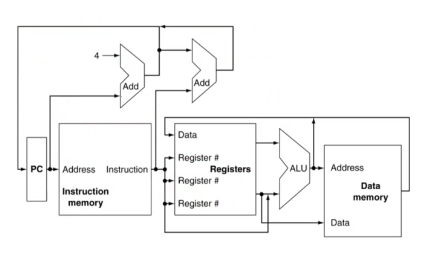

### 4.2 Logic Design Conventions

- Loginc Design Basics
	- Information encoded in binary
		- Low voltage = 0, High voltage = 1
		- One wire per bit
		- Multi-bit data encoded on multi-wire buses
	- Combinational element
		- Operate on data
		- Output is a function of input
	- State (sequential) elements
		- Store information

- Clocking Methodology
	- Combinational logic transforms data during clcock cycles
		- Between clock edges
		- Input from state elements, output to state element
		- Longest delay determines clock period

### 4.3 Building a Datapath

- Building a Datapath
	- Datapath
		- Elements that process data and addresses in the CPU
			- Registers, ALUs, mux's, memories, ...
	- We will build a MIPS datapath incrementally
		- Refining the overview design

- R-Format Instructions
	- Read two register operands
	- Perform arithmetic/logical operation
	- Write register result

- Load/Store Instructions
	- Read register operands
	- Calculate address using 16-bit offset
		- Use ALU, but [sign-extend](https://en.wikipedia.org/wiki/Sign_extension) offset
	- Load: Read memory and update register
	- Store: Write register value to memory

- Branch Instructions
	- Read register operands
	- Compare operands
		- Use ALU, subtract and check Zero output
	- Calculate target address
		- Sign-extend displacement
		- Shift left 2 places (word displacement)
		- Add to PC + 4
			Already calculated by instruction fetch

- Full Datapath
	

### 4.4 A Simple Implement Scheme

- ALU Control
	- ALU used for
		- Load/Store: F = add
		- Branch: F = subtract
		- R-type: F depends on funct field
	|ALU control|Function|
	|---|---|
	|0000|AND|
	|0001|OR|
	|0010|add|
	|0110|substract|
	|0111|set-on-less-than|
	|1100|NOR|
	- Assume 2-bit ALUOp derived from opcode
		- Combinational logic derives ALU control
	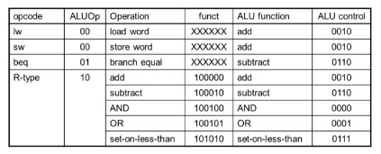

- The Main Control Unit
	- Control signals derived from instruction
	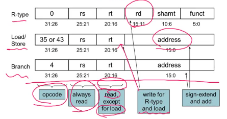

- Datapath With Control
	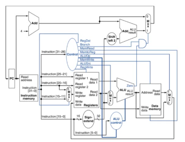

- Performance Issues
	- Longest delay determines clock period
		- Critical path: load instruction
		- Instruction memory -> register file -> ALU -> data memory -> register file
	- Not feasible to vary period for different instructions
	- Violates design principle
		- Making the common case fast
	- We will improve performance by pipelining

### 4.5 An Overview of Pipelining

- Pipelined laundry: overlapping execution
	- Parallelism improves performance

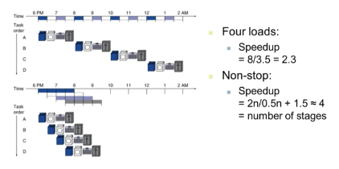

- MIPS Pipeline
	- Five stages, one step per stage
		1. IF: Instruction fetch from memory
		2. ID: Instruction decode & register read
		3. EX: Execute operation or calculate address
		4. MEM: Access memory operand
		5. WB: Write result back to register

- Pipeline Performance
	- Assume time for stages is
		- 100ps for register read or write
		- 200ps for other stages
	- Compare pipelined datapath with single-cycle datapath

	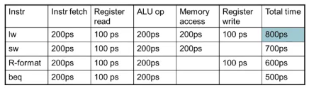

- Pipeline Performance
	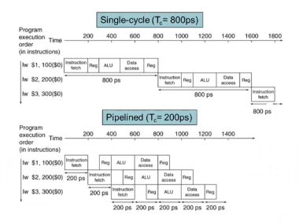

- Pipeline Speedup
	- If all stages are balanced
		- i.e., all take the same time
		- `Time between instructions(pipelined) = Time between instructions(nonpipelined) / Number of stages`
		- If not balanced, speedup is less
		- Speedup due to increased throughput
			- Latency (time for each instruction) does not decrease

- Pipelining and ISA Design
	- MIPS ISA designed for pipelining
		- All instructions are 32-bits
			- Easier to fetch and decode in one cycle
			- c.f. x86: 1 - to 17 byte instructions
		- Few and regular instruction formats
			- Can decode and read registers in one step
		- Load/store addressing
			- Can calculate address in 3nd stage, access memory in 4th stage
		- Alignment of memory operands
			- Memory access takes only one cycle

### 4.5 An Overview of Pipelining

- Hazards
	- Situations that prevent starting the next instruction in the next cycle
	- Structure hazards
		- A required resource is busy
	- Data hazard
		- Need to wait for previous instruction to complete its data read/write
	- Control hazard
		- Deciding on control action depends on previous instruction

- Structure Hazards
	- Conflict for use of a resource
	- In MIPS pipeline with a signle memory
		- Load/Store requires data access
		- Insturction fetch would have to stall for that cycle
			- Would cause a pipeline "bubble"
		- Hence, pipelined datapaths require separate instruction/data memories
			- Or seperate instruction/data caches

- Data Hazards
	- An instruction depends on completion of data access by a previous instruction
		```mips
		add $s0, $t0, $t1
		sub $t2, $s0, $t3
		```
		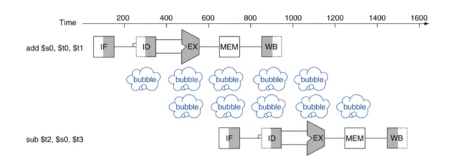

- Fowarding
	- Use result when it is computed
		- Don't wait for it to be stored in a register
		- Requires extra connections in the datapath
		

- Load-Use Data Hazard
	- Can't always avoid stalls by forwarding
		- If value not computed when needed
		- Can't forward backward in time!
		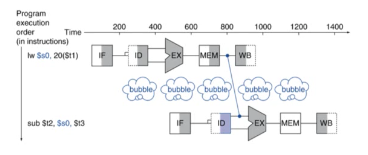

- Code Scheduling to Avoid Stalls
	- Reorder code to avoid use of load result in the next instruction
	- C code for A = B + E; C = B + F;
	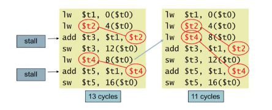
	- Data hazard는 RAW(read after write)에 발생한다
		- code dependency의 종류
			1. RAW
			2. RAR
			3. WAR
			4. WAW
	
- Control Hazards
	- Branch determines flow of control
		- Fetching next instruction depends on branch outcome
		- Pipeline can't always fetch correct instruction
			- Still working on ID stage of branch
	- In MIPS pipeline
		- Need to compare registers and compute target early in the pipeline
		- Add hardware to do it in ID stage

- Stall on Branch
	- Wait until branch outcome determined before fetching next instruction
	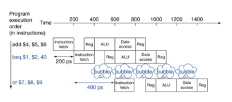

- Branch Prediction
	- Longer pipelines can't readily determine branch outcome early
		- Stall penalty becomes unacceptable
	- Predict outcome of branch
		- Only stall if prediction is wrong
	- In MIPS pipeline
		- Can predict branches not taken
		- Fetch instruction after branch, with no delay

- MIPS with Predict Not Taken
	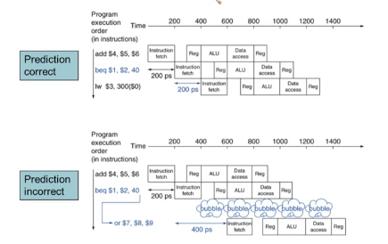

- More-Realistic Branch Prediction
	- Static branch prediction
		- Based on typical branch behavior
		- Example: loop and if-statement branches
			- Predict backward branches taken
			- Predict forward branches not taken
	- Dynamic branch prediction
		- Hardware measures actual branch behavior
			- e.g., record recent history of each branch
		- Assume future behavior will continue the tred
			- When wrong, stall while re-fetching, and update history

- Pipeline Summary
	- Pipelining improves performance by increasing instruction throughput
		- Executes multiple instructions in parallel
		- Each instruction has the same latency
	- Subject to hazards
		- Structure, data, control
	- Instruction set design affects complexity of pipeline implementation

### 4.6 Pipelined Datapath and Control