> 본 글은 영남대학교 최규상 교수님의 [컴퓨터 구조](http://www.kocw.net/home/cview.do?cid=184062fa9a833237) 강의를 듣고 작성된 글입니다.

### 4.1 Introduction

- CPU performance factors
	- Instruction count
		- Determined by ISA and compiler
	- CPI and Cycle time
		- Determined by CPU hardware

- We will examine two MIPS implementations
	- A simplified version
	- A more realistic pipelined version

- Instruction Execution
	- PC (program counter) -> instruction memory, fetch instruction
	- Register numbers -> register file, read registers
	- Depending on instruction class
		- Use ALU to calculate
			- Arithmetic result
			- Memory address for load/store
			- Branch target address
		- Access data memory for load/sotre
		- PC <- target address or PC + 4

- CPU Overview
	

### 4.2 Logic Design Conventions

- Loginc Design Basics
	- Information encoded in binary
		- Low voltage = 0, High voltage = 1
		- One wire per bit
		- Multi-bit data encoded on multi-wire buses
	- Combinational element
		- Operate on data
		- Output is a function of input
	- State (sequential) elements
		- Store information

- Clocking Methodology
	- Combinational logic transforms data during clcock cycles
		- Between clock edges
		- Input from state elements, output to state element
		- Longest delay determines clock period

### 4.3 Building a Datapath

- Building a Datapath
	- Datapath
		- Elements that process data and addresses in the CPU
			- Registers, ALUs, mux's, memories, ...
	- We will build a MIPS datapath incrementally
		- Refining the overview design

- R-Format Instructions
	- Read two register operands
	- Perform arithmetic/logical operation
	- Write register result

- Load/Store Instructions
	- Read register operands
	- Calculate address using 16-bit offset
		- Use ALU, but [sign-extend](https://en.wikipedia.org/wiki/Sign_extension) offset
	- Load: Read memory and update register
	- Store: Write register value to memory

- Branch Instructions
	- Read register operands
	- Compare operands
		- Use ALU, subtract and check Zero output
	- Calculate target address
		- Sign-extend displacement
		- Shift left 2 places (word displacement)
		- Add to PC + 4
			Already calculated by instruction fetch

- Full Datapath
	

### 4.4 A Simple Implement Scheme

- ALU Control
	- ALU used for
		- Load/Store: F = add
		- Branch: F = subtract
		- R-type: F depends on funct field
	|ALU control|Function|
	|---|---|
	|0000|AND|
	|0001|OR|
	|0010|add|
	|0110|substract|
	|0111|set-on-less-than|
	|1100|NOR|
	- Assume 2-bit ALUOp derived from opcode
		- Combinational logic derives ALU control
	

- The Main Control Unit
	- Control signals derived from instruction
	

- Datapath With Control
	

- Performance Issues
	- Longest delay determines clock period
		- Critical path: load instruction
		- Instruction memory -> register file -> ALU -> data memory -> register file
	- Not feasible to vary period for different instructions
	- Violates design principle
		- Making the common case fast
	- We will improve performance by pipelining

### 4.5 An Overview of Pipelining

- Pipelined laundry: overlapping execution
	- Parallelism improves performance


- MIPS Pipeline
	- Five stages, one step per stage
		1. IF: Instruction fetch from memory
		2. ID: Instruction decode & register read
		3. EX: Execute operation or calculate address
		4. MEM: Access memory operand
		5. WB: Write result back to register

- Pipeline Performance
	- Assume time for stages is
		- 100ps for register read or write
		- 200ps for other stages
	- Compare pipelined datapath with single-cycle datapath

	

- Pipeline Performance
	

- Pipeline Speedup
	- If all stages are balanced
		- i.e., all take the same time
		- `Time between instructions(pipelined) = Time between instructions(nonpipelined) / Number of stages`
		- If not balanced, speedup is less
		- Speedup due to increased throughput
			- Latency (time for each instruction) does not decrease

- Pipelining and ISA Design
	- MIPS ISA designed for pipelining
		- All instructions are 32-bits
			- Easier to fetch and decode in one cycle
			- c.f. x86: 1 - to 17 byte instructions
		- Few and regular instruction formats
			- Can decode and read registers in one step
		- Load/store addressing
			- Can calculate address in 3nd stage, access memory in 4th stage
		- Alignment of memory operands
			- Memory access takes only one cycle

### 4.5 An Overview of Pipelining

- Hazards
	- Situations that prevent starting the next instruction in the next cycle
	- Structure hazards
		- A required resource is busy
	- Data hazard
		- Need to wait for previous instruction to complete its data read/write
	- Control hazard
		- Deciding on control action depends on previous instruction

- Structure Hazards
	- Conflict for use of a resource
	- In MIPS pipeline with a signle memory
		- Load/Store requires data access
		- Insturction fetch would have to stall for that cycle
			- Would cause a pipeline "bubble"
		- Hence, pipelined datapaths require separate instruction/data memories
			- Or seperate instruction/data caches

- Data Hazards
	- An instruction depends on completion of data access by a previous instruction
		```mips
		add $s0, $t0, $t1
		sub $t2, $s0, $t3
		```
		

- Fowarding
	- Use result when it is computed
		- Don't wait for it to be stored in a register
		- Requires extra connections in the datapath
		

- Load-Use Data Hazard
	- Can't always avoid stalls by forwarding
		- If value not computed when needed
		- Can't forward backward in time!
		

- Code Scheduling to Avoid Stalls
	- Reorder code to avoid use of load result in the next instruction
	- C code for A = B + E; C = B + F;
	
	- Data hazard는 RAW(read after write)에 발생한다
		- code dependency의 종류
			1. RAW
			2. RAR
			3. WAR
			4. WAW
	
- Control Hazards
	- Branch determines flow of control
		- Fetching next instruction depends on branch outcome
		- Pipeline can't always fetch correct instruction
			- Still working on ID stage of branch
	- In MIPS pipeline
		- Need to compare registers and compute target early in the pipeline
		- Add hardware to do it in ID stage

- Stall on Branch
	- Wait until branch outcome determined before fetching next instruction
	

- Branch Prediction
	- Longer pipelines can't readily determine branch outcome early
		- Stall penalty becomes unacceptable
	- Predict outcome of branch
		- Only stall if prediction is wrong
	- In MIPS pipeline
		- Can predict branches not taken
		- Fetch instruction after branch, with no delay

- MIPS with Predict Not Taken
	

- More-Realistic Branch Prediction
	- Static branch prediction
		- Based on typical branch behavior
		- Example: loop and if-statement branches
			- Predict backward branches taken
			- Predict forward branches not taken
	- Dynamic branch prediction
		- Hardware measures actual branch behavior
			- e.g., record recent history of each branch
		- Assume future behavior will continue the tred
			- When wrong, stall while re-fetching, and update history

- Pipeline Summary
	- Pipelining improves performance by increasing instruction throughput
		- Executes multiple instructions in parallel
		- Each instruction has the same latency
	- Subject to hazards
		- Structure, data, control
	- Instruction set design affects complexity of pipeline implementation

### 4.6 Pipelined Datapath and Control

- MIPS Pipelined Datapath
	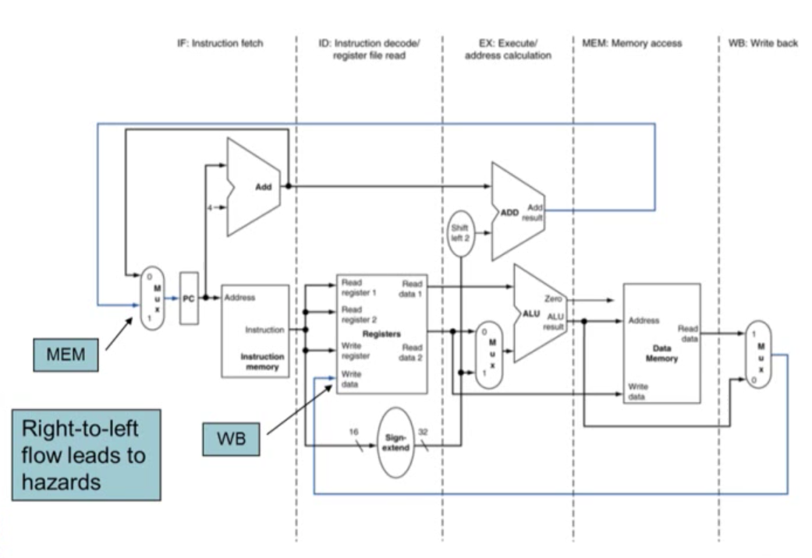

- Pipeline registers
	- Need registers between stages
		- To hold information produced in previous cycle
	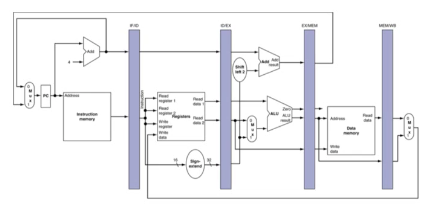

- Pipeline Operation
	- Cycle-by-cycle flow of instructions through the pipelined datapath
		- "Single-clock-cycle" pipeline diagram
			- Shows pipeline usage in a signle cycle
			- Highlight resources used
		- c.f. "multi-clock-cycle" diagram
			- Graph of operation over time
	
- Multi-Cycle Pipeline Diagram
	- Form showing resource usage
	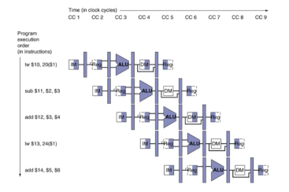
	- Traditional form
	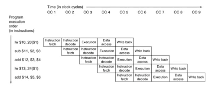

- Single-Cycle Pipeline Diagram
	- State of pipeline in a given cycle
	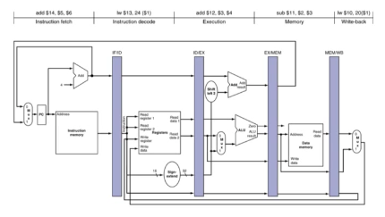

- Pipelined Control (Simplified)
	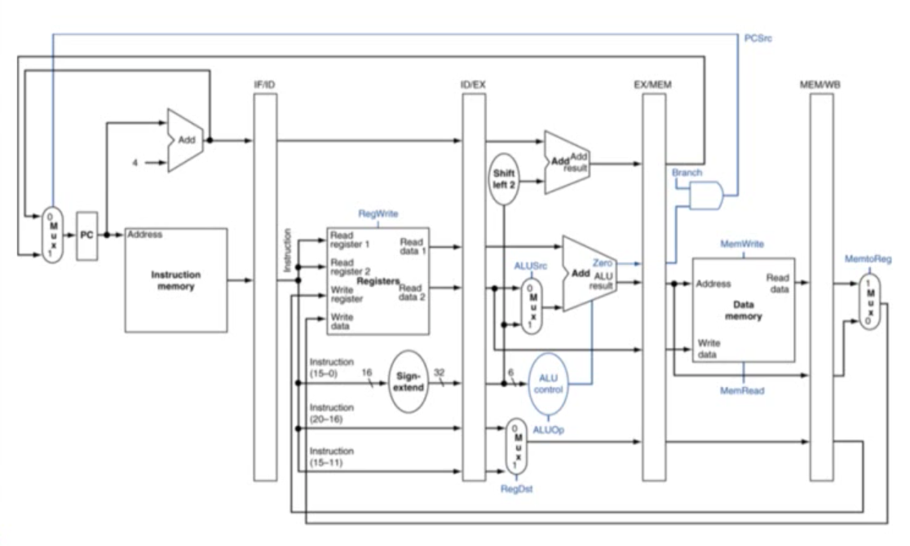

- Pipelined Control
	- Control signals derived from instruction
		- As in signle-cycle implementation
	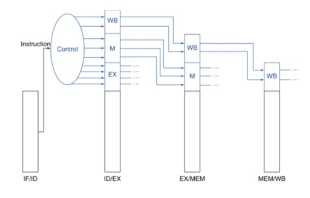
	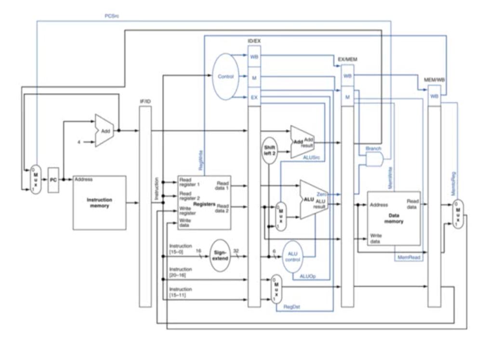

### 4.7 Data Hazards: Forwarding vs Stalling

- Data Hazards in ALU Instructions
	- Consider this sequence:
		```mips
		sub $2, $1, $3
		and $12, $2, $5
		or $13, $6, $2
		add $14, $2, $2
		sw $15, 100($2)
		```
	- We can resolve hazards with forwarding
		- How do we detect when to forward?

- Dependencies & Forwarding
	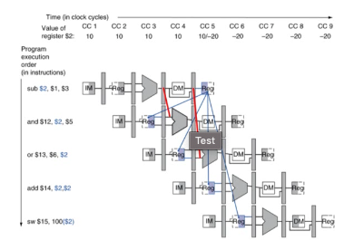

- Detecting the Need to Forward
	- Pass register numbers along pipeline
		- e.g., ID/EX.RegisterRs = register number for Rs sitting in ID/EX pipeline register
	- ALU operand register numbers in EX stage are given by
		- ID/EX.RegisterRs, ID/EX.RegisterRt
	- Data hazards when
		1. EX/MEM.RegisterRd = ID/EX.RegisterRs
		2. EX/MEM.RegisterRd = ID/EX.RegisterRt
		3. MEM/WB.RegisterRd = ID/EX.RegisterRs
		4. MEM/WB.RegisterRd = ID/EX.RegisterRt

- Detecting the Need to Foward
	- But only if forwarding instruction will write to a register!
		- EX/MEM.RegWrite, MEM/WB.RegWrite
	- And only if Rd for that instruction is not $zero
		- EX/MEM.RegisterRd != 0
		- MEM/WB.RegisterRd != 0

- Forwarding Paths
	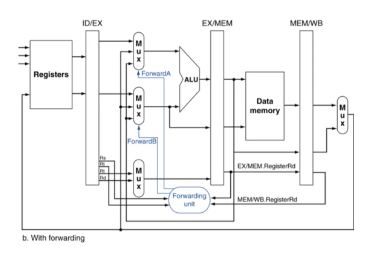

- Forwarding Conditions
	

- Double Data Hazard
	- Consider the sequence
		```mips
		add $1, $1, $2
		add $1, $1, $3
		add $1, $1, $4
		```
	- Both hazards occur
		- Want to use the most recent
	- Revise MEM hazard condition
		- Only fwd if EX hazard condition isn't true
	
- Revised Forwarding Condition
	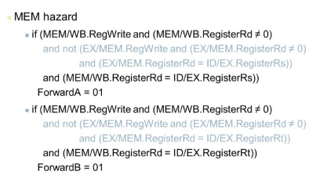

- Datapath with Forwarding
	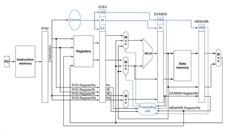

- Load-Use Data Hazard
	

- Load-Use Hazard Detection
	- Check when using instruction is decoded in ID stage
	- ALU operand register numbers in ID stage are given by
		- IF/ID.RegisterRs, IF/ID.RegisterRt
	- Load-use hazard when
		- ID/EX.MemRead and ((ID/EX.RegisterRt = IF/ID.RegisterRs) or (ID/EX.RegisterRt = IF/ID.RegisterRt))
	- If detected, stall and insert bubble

- How to Stall the Pipeline
	- Force control values in ID/EX register to 0
		- EX, MEM, and WB do nop (no-operation)
	- Prevent update of PC and IF/ID register
		- Using instruction is decoded again
		- Following instruction is fetched again
		- 1-cycle stall allows MEM to read data for lw
			- Can subsequently forward to EX stage

- Stall/Bubble in the Pipeline
	- simplified
	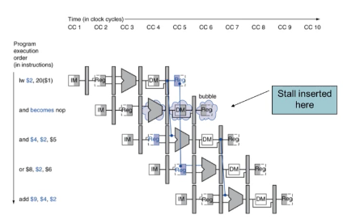
	- real
	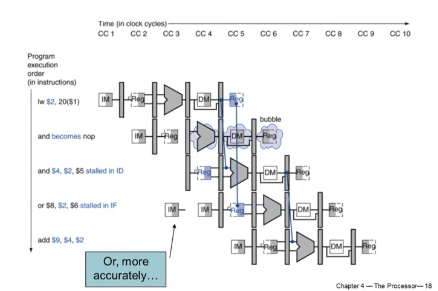

- Datapath with Hazard Detection
	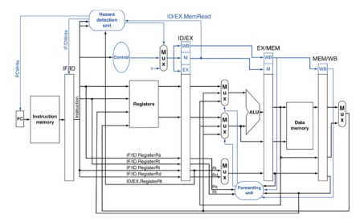

- Stalls and Performance
	- Stalls reduce performance
		- But are required to get correct results
	- Compiler can arrange code to avoid hazards and stalls
		- Requires knowledge of the pipeline structure

- Branch Hazards
	- If branch outcome determined in MEM
		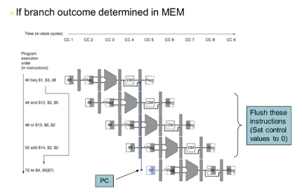

- Reducing Branch Delay
	- Move hardware to determine outcome to ID stage
		- Target address adder
		- Register address adder

- Example: Branch Taken
	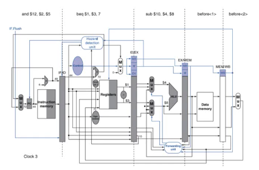

### 4.8 Control Hazards

- Data Hazards for Branches
	- If a comparison register is a destination of 2nd or 3rd preceding ALU instruction
	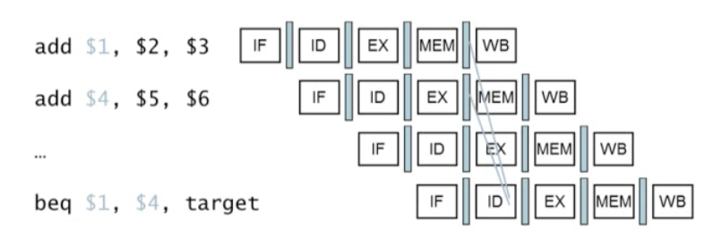
	- Can resolve using forwarding
	- If a comparison register is a destination of preceding ALU instruction or 2nd preceding load instruction
		- Need 1 stall cycle
	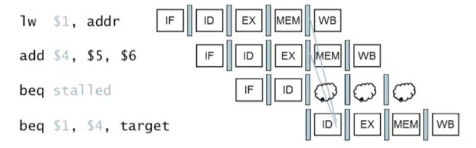
	- If a comparison register is a destination of immediately preceding load instruction
		- Need 2 stall cycles
	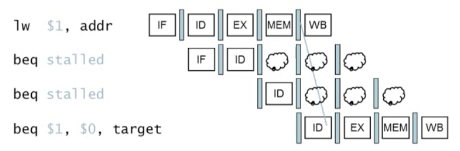

- Dynamic Branch Prediction
	- In deeper and superscalar pipelines, branch penalty is more significant
	- Use dynamic prediction
		- Branch prediction buffer (aka branch history table)
		- Indexed by recent branch instruction addresses
		- Stores outcome (taken/not taken)
		- To execute a branch
			- Check table, expect the same outcome
			- Start fetching from fall-through or target
			- If wrong, flush pipeline and flip prediction

- 1-Bit Predictor: Shortcoming
	- Inner loop branches mispredicted twice
		- Mispredict as taken on last iteration of inner loop
		- Then mispredict as not taken on first iteration of inner loop next time around

- 2-Bit predictor
	- Only change prediction on two successive mispredicitions
	

- Calculating the Branch Target
	- Even with predictor, still need to calculate the target address
		- 1-cycle penalty for a taken branch
	- Branch target buffer
		- Cache of target addresses
		- Indexed by PC when instruction fetched
			- If hit and instruction is branch predicted taken, can fetch target immediately

### 4.9 Exceptions

- Exceptions and Interrupts
	- "Unexpected" events requiring change in flow of control
		- Different ISAs use the terms differently
	- Exception
		- Arises within the CPU
			- e.g., undefined opcode, overflow, syscall, ...
	- Interrupt
		- From an external I/O controller
	- Trap (Software Interrupt)
		- System call을 사용할 때 발생, 소프트웨어가 명령어를 수행할 때 interrupt가 발생하는 것
	- Dealing with them without sacrificing performance is hard

- Handling Exceptions
	- In MIPS exceptions managed by a System Control Coprocessor (CP0)
	- Save PC of offending (or interrupted) instruction
		- In MIPS: Exception Program Counter (EPC)
	- Save indication of the problem
		- In MIPS: Cause register
		- We'll assume 1-bit
			- 0 for undefined opcode,1 for overflow
	- Jump to handler at 8000 00180

- An Alternate Mechanism
	- Vectored Interrupts
		- Handler address determined by the cause
	- Example:
		- Undefined opcode: C000 0000
		- Overflow: C000 0020
		- ...: C000 0040
	- Instructions either
		- Deal with the interrupt, or
		- Jump to real handler

- Handler Actions
	- Read cause, and transfer to relevant handler
	- Determine action required
	- If restartable
		- Take corrective action
		- use EPC to return to program
	- Otherwise
		- Terminate program
		- Report error using EPC, cause, ...

- Exceptions in a Pipeline
	- Another form of control hazard
	- Consider overflow on add in EX stage
		- add $1, $2, $1
		- Prevent $1 from being clobbered
		- Complete previous instructions
		- Flush add and subsequent instructions
		- Set Cause and EPC register values
		- Transfer control to handler
	- Similar to mispredicted branch
		- Use much of the same hardware

- Pipeline with Exceptions
	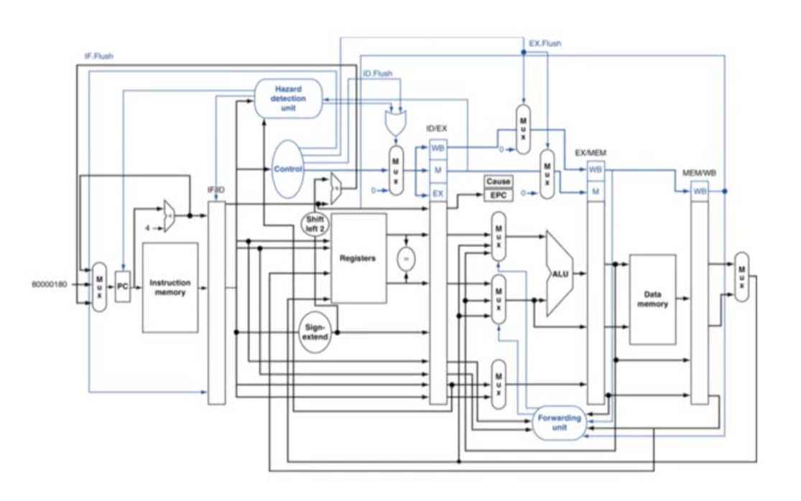

- Exception Properties
	- Restartable exceptions
		- Pipeline can flush the instruction
		- Handler executes, then returns to the instruction
			- Refetched and executed from scratch
	- PC saved in EPC register
		- Identifies causing instruction
		- Actually PC + 4 is saved
			- Handler must adjust

- Exception Example
	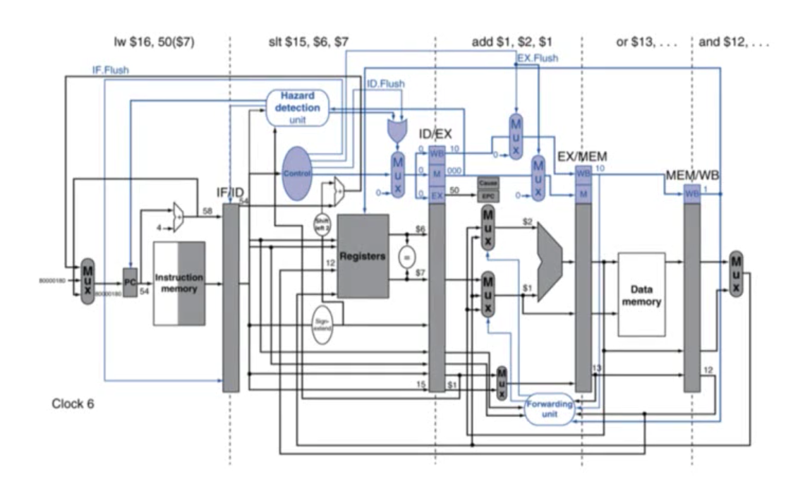
	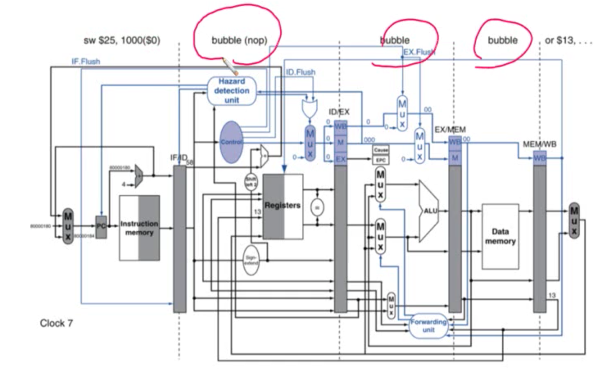

- Multiple Exceptions
	- Pipelining overlaps multiple instructions
		- Could have multiple exceptions at once
	- Simpe approach: deal with exception from earliest instruction
		- Flush subsequent instructions
		- "Precise" exceptions
	- In complex pipelines
		- Multiple instructions issued per cycle
		- Out-of-order completion
		- Maintaining precise exceptions is difficult

- Imprecise Exceptions
	- Just stop pipeline and save state
		- Including exception cause(s)
	- Let the handler work out
		- Which instruction(s) had exceptions
		- Which to complete or flush
			- May require "manual" completion
	- Simplifies hardware, but more complex handler software
	- Not feasible for complex multiple-issue out-of-order pipelines
