> 본 글은 영남대학교 최규상 교수님의 [컴퓨터 구조](http://www.kocw.net/home/cview.do?cid=184062fa9a833237) 강의를 듣고 작성된 글입니다.

### 5.1 Introduction

- Principle of Locality
	- Programs access a small proportion of their address space at any time
	- Temporal locality
		- Items accessed recently are likely to be accessed again soon
		- e.g., instructions in a loop, induction variables
	- Spatial locality
		- Items near those accessed recently are likely to be accessed soon
		- e.g., sequential instruction access, array data

- Taking Advantage of Locality
	- Memory hierarchy
	- Store everything on disk
	- Copy recently accessed (and nearby) items from disk to smaller DRAM memory
		- Main memory
	- Copy more recently accessed (and nearby) items from DRAM to smaller SRAM memory
		- Cache memory attached to CPU

- Memory Hierarchy Levels
	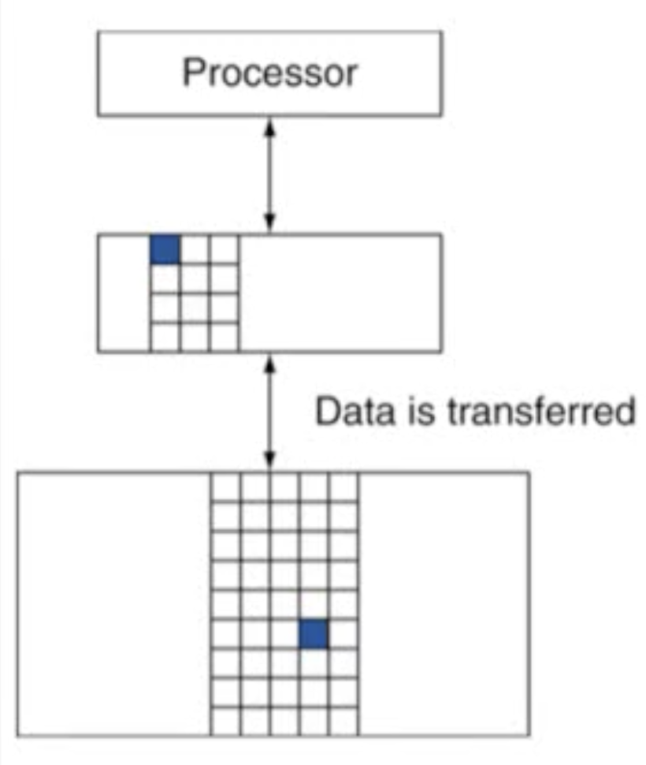
	- Block (aka line): unit of copying
		- May be multiple words
	- If accessed data is present in upper level
		- Hit: access satisfied by upper level
			- Hit ratio: hits/accesses
	- If accessed data is absent
		- Miss: block copied from lower level
			- Time taken: miss penalty
			- Miss ratio: misses/accesses = 1 - hit ratio
		- Then accessed data supplied from upper level

- Characteristics of the Memory Hierarchy
	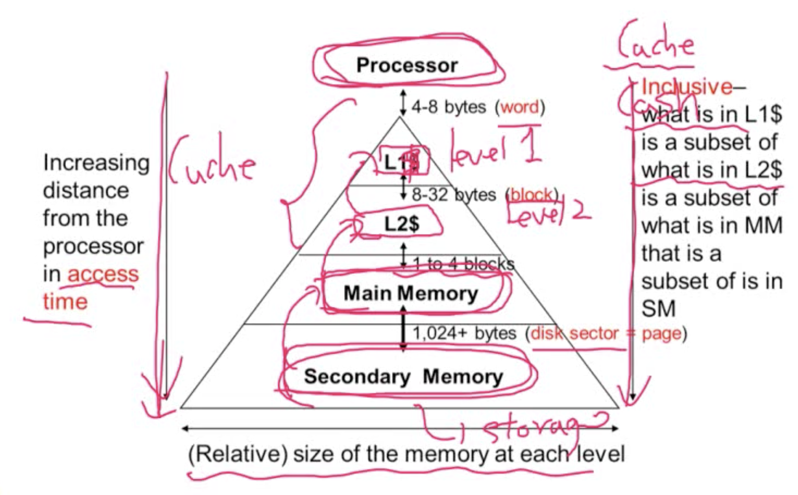

- DRAM Technology
	- Data stored as a charge in a capacitor
		- Single transistor used to access the charge
		- Must periodically be refreshed
			- Read contents and write back
			- Performed on a DRAM "row"
	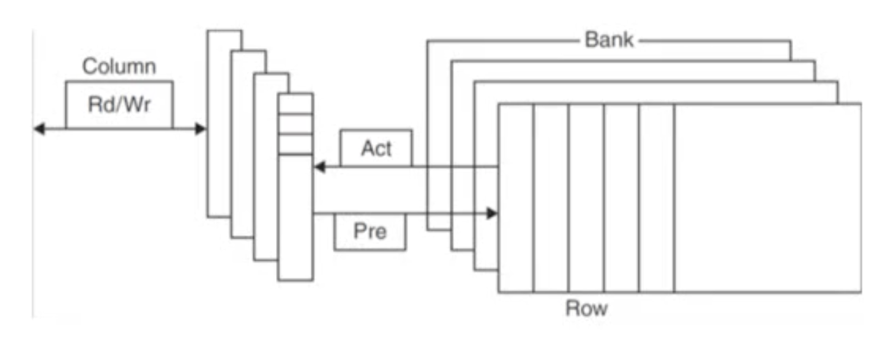

- Advanced DRAM Organization
	- Bits in a DRAM are organized as a rectangular array
		- DRAM accesses an entire row
		- Burst mode: supply successive words from a row with reduced latency
	- Double data rate (DDR) DRAM
		- Transfer on rising and falling clock edges
	- Quad data rate (QDR) DRAM
		- Separate DDR inputs and outputs

- DRAM Generations
	- 시간이 지남에따라 가격은 낮아지고 용량은 증가하였음

- DRAM Performance Factors
	- Row buffer
		- Allows several words to be read and refreshed in parallel
	- Synchronous DRAM
		- Allows for consecutive accesses in bursts without needing to send each address
		- Improves bandwidth
	- DRAM banking
		- Allows simultaneous access to multiple DRAMs
		- Improves bandwidth

- Main Memory Supporting Caches
	- Use DRAMs for main memory
		- Fixed width (e.g., 1 word)
		- Connected by fixed-width clocked bus
			- Bus clock is typically slower than CPU clock
	- Example cache block read
		- 1 bus cycle for address transfer
		- 15 bus cycles per DRAM access
		- 1 bus cycle per data transfer
	- For 4-word block, 1-word-wide DRAM
		- Miss penalty = 1 + 4 * 15 + 4 * 1 = 65 bus cycles
		- Bandwidth = 16 bytes / 65 cycles = 0.25 B/cycle

- Increasing Memory Bandwidth
	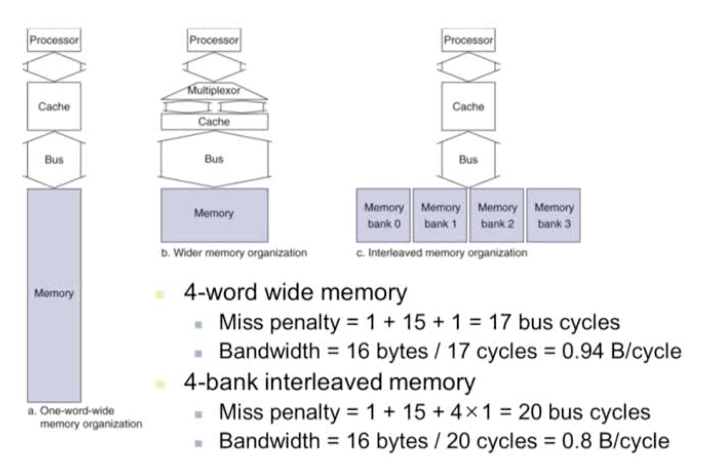

### 5.2 Memory Technologies

- Review: Major Components of a Comupter
	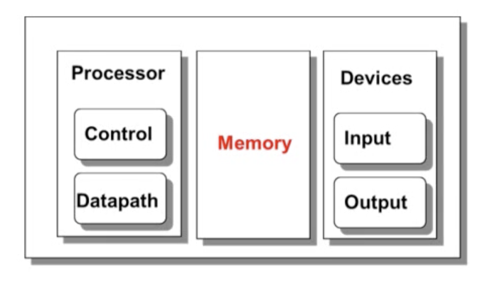

- Memory Technology
	- Static RAM (SRAM)
		- 0.5ns ~ 2.5ns, $2000 ~ $5000 per GB
	- Dynamic RAM (DRAM)
		- 50ns ~ 70ns, $20 ~ $75 per GB
	- Magnetic disk (HD)
		- 5ms ~ 20ms, $0.20 ~ $2 per GB
	- Ideal memory
		- Access time of SRAM
		- Capacity and cost/GB of disk

- Processor-Memory Performance Gap
	- 프로세서와 메모리의 성능 차이는 시간이 지날수록 양극화되어 왔다.

- The "Memory Wall"
	- Processor vs DRAM speed disparity continues to grow
	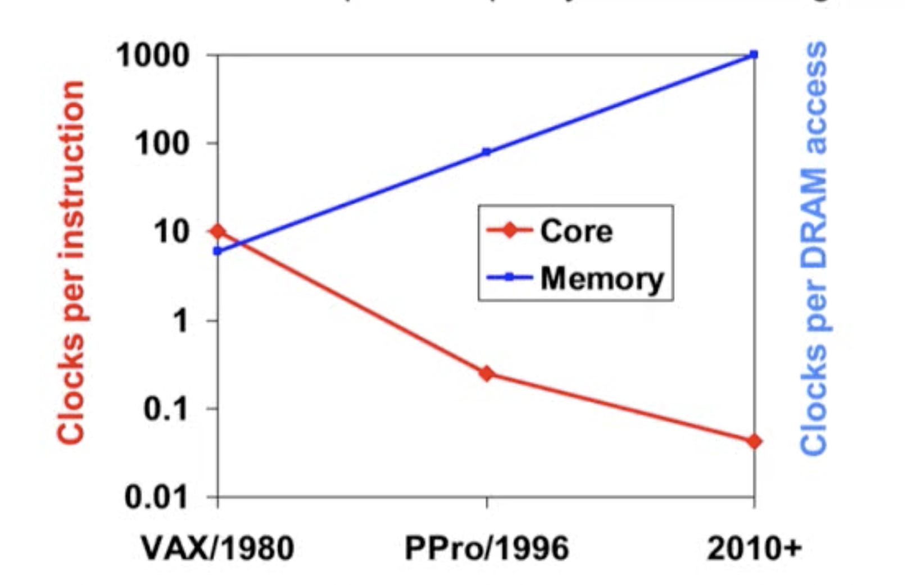
	- Good memory hierachy (cache) design is increasingly important to overall performance

### 5.3 The Basics of Caches

- Cache Memory
	- Cache memory
		- The level of the memory hierarchy closest to the CPU
	- Given accesses X1, ..., Xn-1, Xn
	- How do we know if the data is present?
	- Where do we look?
	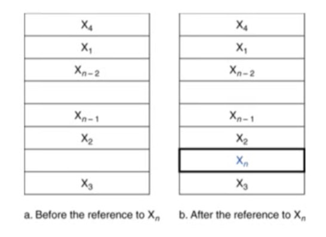
	
- Caching: A Simple First Example
	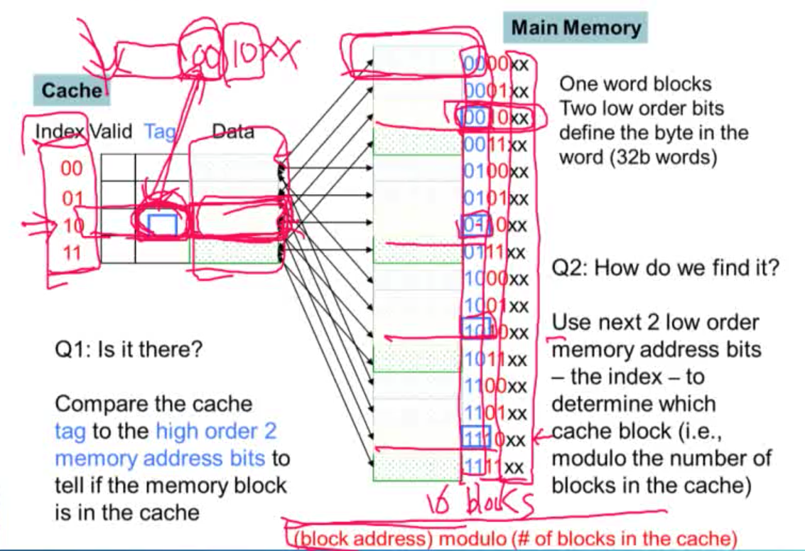

- Direct Mapped Cache
	- Location determined by address
	- Direct mapped: only one choice
		- (Block address) modulo (#Blocks in cache)
	- #Block is a power of 2
	- Use low-order address bits
	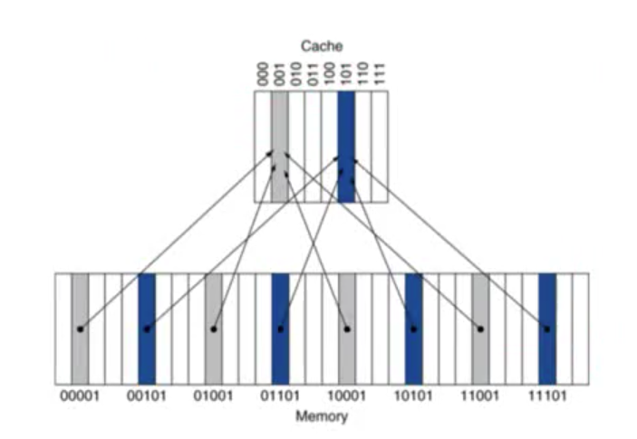

- Tags and Valid Bits
	- How do we know which particular block is stored in a cache location?
		- Store block address as well as the data
		- Actually, only need the high-order bits
		- Called the tag
	- What if there is no data in a location?
		- Valid bit: 1 = present, 0 = not present
		- Initially 0

- MIPS Direct Mapped Cache Example
	- One word blocks, cache size = 1K words (or 4KB)
	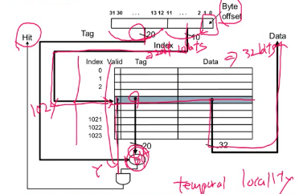

- Example: Larger Block Size
	- 64 blocks, 16 bytes/block
		- To what block number does address 1200 map?
	- Block address = 1200 / 16 = 75
	- Block number = 75 modulo 64 = 11
	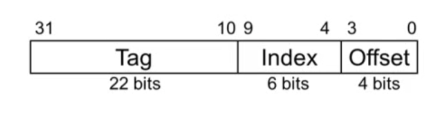

- Multiword Block Direct Mapped Cache
	- Four word/block, cache size = 1K words
	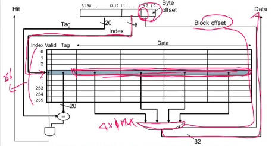

- Block Size Considerations
	- Larger blocks should reduce miss rate
		- Due to spatial locality
	- But in a fixed-sized cache
		- Larger blocks -> fewer of them
			- More competition -> increased miss rate
		- Larger blocks -> pollution
	- Larger miss penalty
		- Can override benefit of reduced miss rate
		- Early restart and critical-word-first can help

- Cache Misses
	- On cache hit, CPU proceeds normally
	- On cache miss
		- Stall the CPU pipeline
		- Fetch block from next level of hierachy
		- Instruction cache miss
			- Restart instruction fetch
		- Data cache miss
			- Compleete data access

- Write-Through
	- On data-write hit, could just update the block in cache
		- But then cache and memory would be inconsistent
	- Write through: also update memory
	- But makes writes take longer
		- e.g., if base CPI = 1, 10% of instructions are stores, write to memory takes 100 cycles
			- Effective CPI = 1 + 0.1 * 100 = 11
	- Solution: write buffer
		- Holds data waiting to be written to be written memory
		- CPU continues immediately
			- Only stalls on write if write buffer is already full

- Write-Back
	- Alternative: On data-write hit, just update the block in cache
		- Keep track of whether each block is dirty
	- When a dirty block is replaced
		- Write it back to memory
		- Can use a write buffer to allow replacing block to be read first

- Wirte Allocation
	- What should happen on a write miss?
	- Alternatives for write-through
		- Allocate on miss: fetch the block
		- Write around: don't fetch the block
			- Since programs often write a whole block before reading it (e.g., initialization)
	- For write-back
		- Usually fetch the block

- Example: Intrinsity FastMATH
	- Embedded MIPS processor
		- 12-stage pipeline
		- Instruction and data access on each cycle
	- Split cache: separate I-cache and D-cache
		- Each 16KB: 256 blocks * 16 words/block
		- D-cache: write-through or write-back
	- SPEC2000 miss rates
		- I-cache: 0.4%
		- D-cache: 11.4%
		- Weighted average: 3.2%
	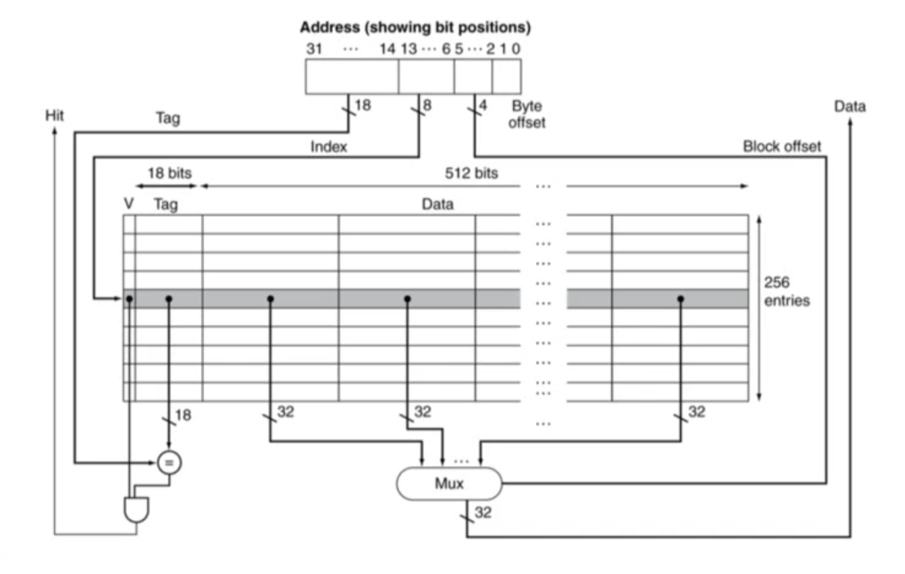

### 5.4 Measuring and Improving Cache Performance

- Measuring Cache Performance
	- Components of CPU time
		- Program execution cycles
			- Includes cache hit time
		- Memory stall cycles
			- Mainly from cache misses
	- With simplifying assumptions:
		```
		Memory stall cycles
		= Memory accesses/Program * Missrate * Miss penalty
		= Instructions/program * Misses/Instruction * Miss penalty
		```

- Cache Performance Example
	- Given
		- I-cache miss rate = 2 %
		- D-cache miss rate = 4 %
		- Miss penalty = 100 cycles
		- Base CPI (ideal cache) = 2
		- Load & stores are 36% of instructions
	- Miss cycles per instruction
		- I-cache: 0.02 * 100 = 2
		- D-cache: 0.36 * 0.04 * 100 = 1.44
	- Actual CPI = 2 + 2 + 1.44 = 5.44
		- Ideal CPU is 5.44/2 = 2.72 times faster

- Average Access Time
	- Hit time is also important for performance
	- Average memory access time (AMAT)
		- AMAT = Hit time + Miss rate * Miss penalty
	- Example
		- CPU with 1ns clock, hit time = 1 cycle, miss penalty = 20 cycles, I-cache miss rate = 5%
		- AMAT = 1 + 0.05 * 20 = 2ns
			- 2 cycles per instruction

- Performance Summary
	- When CPU performance increased
		- Miss penalty becomes more significant
	- Decreasing base CPI
		- Greater proportion of time spent on memory stalls
	- Increasing clock rate
		- Memory stalls account for more CPU cycles
	- Can't neglect cache behavior when evaluating system performance

- Associative Caches
	- Fully associative
		- Allow a given block to go in any cache entry
		- Requires all entries to be searched at once
		- Comparator per entry (expensive)
	- n-way set associative
		- Each set contains n entries
		- Block number determines which set
			- (Block number) modulo (#Sets in cache)
		- Search all entries in a given set at once
		- n comparators (less expensive)

- Associative Cache Example
	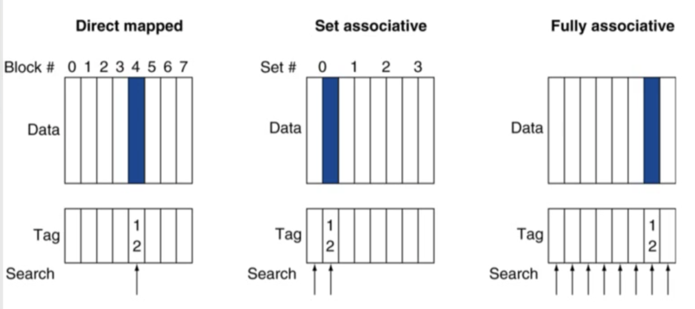

- Spectrum of Associativity
	- For a cache with 8 entries
	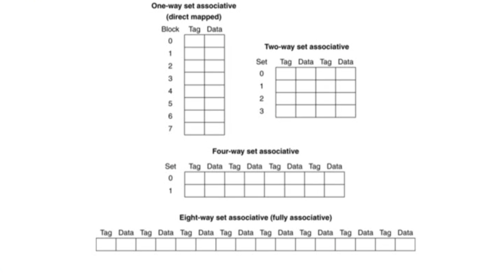

- Associativity Example
	- Compare 4-block caches
		- Direct mapped, 2-way set associative, fully associative
		- Block access sequence: 0, 8, 0, 6, 8
	- Direct mapped
	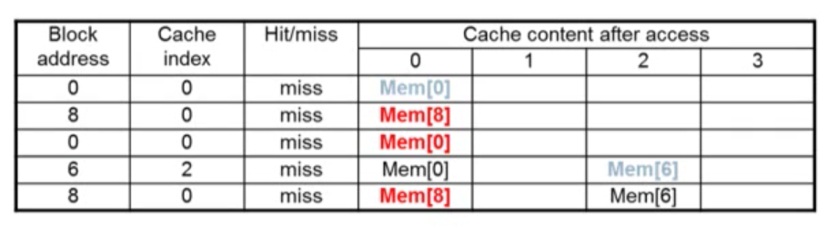
	- 2-way set associative
	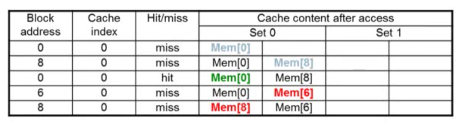
	- Fully associative
	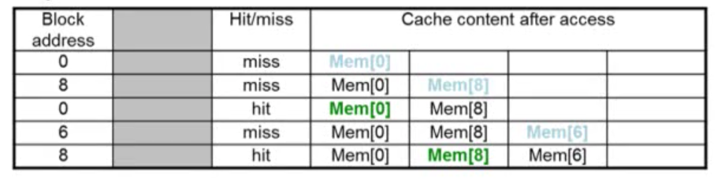

- How Much Associativity
	- Increased associativity decreases miss rate
		- But with diminishing returns
	- Simulation of a system with 64KB
		- D-cache, 16-word blocks, SPEC2000
			- 1-way: 10.3%
			- 2-way: 8.6%
			- 4-way: 8.3%
			- 8-way: 8.1%

- Set Associative Cache Organization
	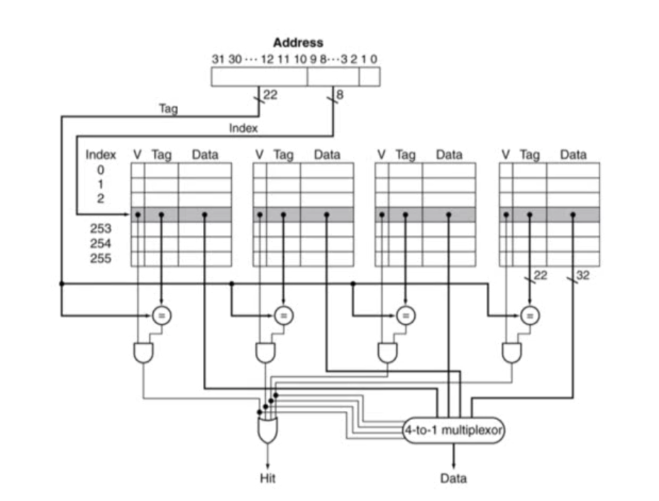

- Replacement Policy
	- Direct mapped: no choice
	- Set associative
		- Prefer non-valid entry, if there is one
		- Otherwise, choose among entries in the set
	- Least-recently used (LRU)
		- Choose the one unused for the longest time
			- Simple for 2-way, manageable for 4-way, too hard beyond that
	- Random
		- Gives approximately the same performance as LRU for high associativity

- Multilevel Caches
	- Primary cache attached to CPU
		- Small, but fast
	- Level-2 cache services misses from primary cache
		- Larger, slower, but still faster than main memory
	- Main memory services L-2 cashe misses
	- Some high-end systems include L-3 cache

- Multilevel Cache Example
	- Given
		- CPU base CPI = 1, clock rate = 4GHz
		- Miss rate/instruction = 2%
		- Main memory access time = 100ns
	- With just primary cache
		- Miss penalty = 100ns/0.25ns = 400 cycles
		- Effective CPI = 1 + 0.02 * 400 = 9
	- Now add L-2 cache
		- Access time = 5ns
		- Global miss rate to main memory = 0.5%
	- Primary miss with L-2 hit
		- Penalty = 5ns/0.25ns = 20cycles
	- Primary miss with L-2 miss
		- Extra penalty = 500 cycles
	- CPI = 1 + 0.02 * 20 + 0.005 * 400 = 3.4
	- Performance ratio = 9/3.4 = 2.6

- Multilevel Cache Considerations
	- Primary cache
		- Focus on minimal hit time
	- L-2 cache
		- Focus on low miss rate to avoid main memory access
		- Hit time has less overall impact
	- Results
		- L-1 cache usually smaller than a single cache
		- L-1 block size smaller than L-2 block size

- Interactions with Advanced CPUs
	- Out-of-order CPUs can execute instructions during cache miss
		- Pending store stays in load/store unit
		- Dependent instructions wait in reservation stations
			- Independent instructions continue
	- Effect of miss depends on program data flow
		- Much harder to analyes
		- Use system simulation

- Interactions with Software
	- Misses depend on memory access patterns
		- Algorithm behavior
		- Compiler optimization for memory access

### 5.6 Virtual Machines

- pass

### 5.7 Virtual Memory

- Virtual Memory
	- Use main memory as a "cache" for secondary (disk) storage
		- Managed jointly by CPU hardware and the operating system (OS)
	- Programs share main memory
		- Each gets a private virtual address space holding its frequently used code and data
		- Protected fro other programs
	- CPU and OS translate virtual addresses to phsyical addresses
		- VM "block" is called a page
		- VM translation "miss" is called a page fault

- Address Translation
	- Fixed-size pages (e.g., 4K)
	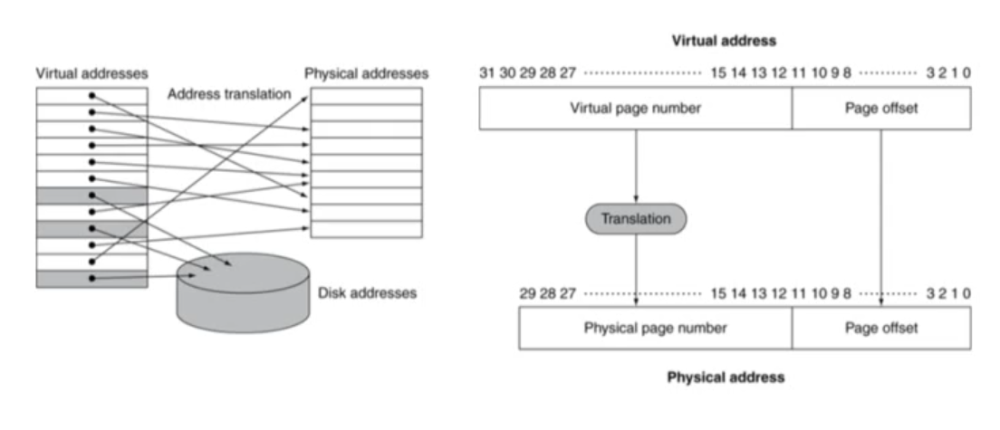

- Virtual Addressing with a Cache
	- Thus it takes an extra memory access to translate a VA to a PA
	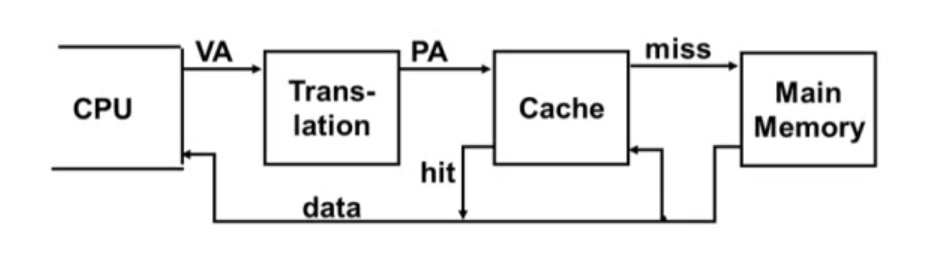
	- This makes memory (cache) accesses very expensive (if every access was really two accesses)
	- The hardware fix is to use a Translation Lookaside Buffer (TLB) - a small cache that keeps track of recently used address maapings to avoid having to do a page table lookup

- Page Fault Penalty
	- On page fault, the page must be fetched from disk
		- Takes millions of clock cycles
		- Handled by OS code
	- Try to minimize page fault rate
		- Fully associative placement
		- Smart replacement algorithms

- Page Tables
	- Stores placement information
		- Array of page table entries, indexed by virtual page number
		- Page table register in CPU points to page table in physical memory
	- If page is present in memory
		- PTE stores the physical page number
		- Plus other status bits (referenced, dirty, ...)
	- If page is not present
		- PTE can refer to location in swap space on disk

- Two Programs Sharing Physical Memory
	- A Program's address space is divided into pages (all one fixed size) or segments (variable sizes)
		- The starting location of each page (either in main memory or in secondary memory) is contained in the program's page table
	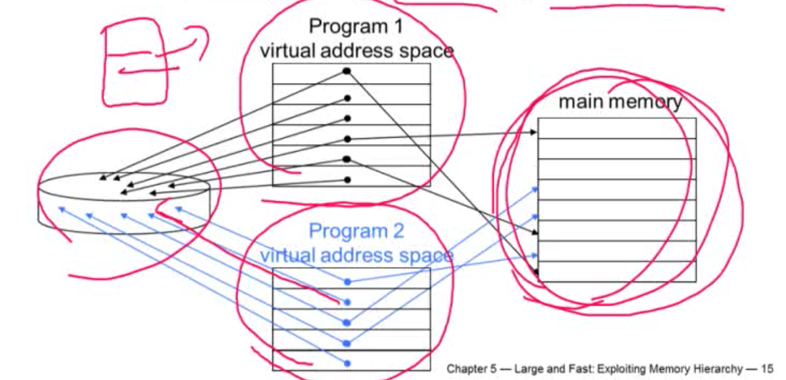

- Translation Using a Page Table
	

- Mapping Pages to Storage
	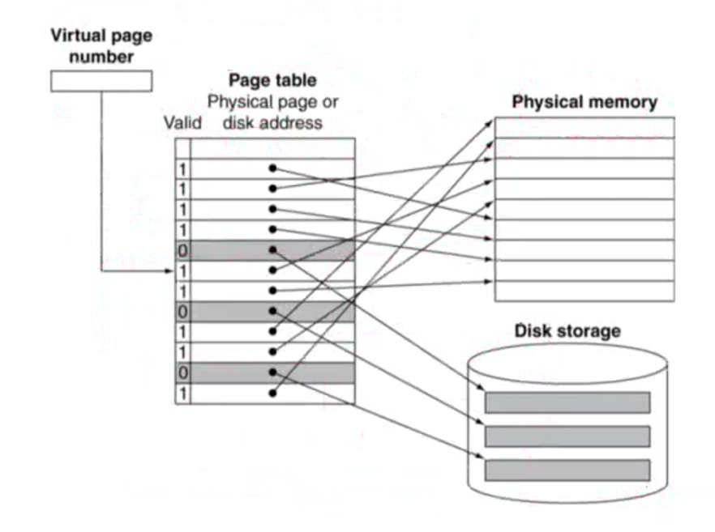

- Replacement and Writes
	- To reduce page fault rate, prefer least-recently used (LRU) replacement
		- Reference bit (aka use bit) in PTE set to 1 on access to page
		- Periodically cleared to 0 by OS
		- A page with reference bit = 0 has not been used recently
	- Disk writes take millions of cycles
		- Block at once, not individual locations
		- Write through is impractical
		- Use write-back
		- Dirty bit in PTE set when page is written

- Fast Translation Using a TLB
	- Address translation would appear to require extra memory references
		- One to access the PTE
		- Then the actual memory access
	- But access to page tables has good locality
		- So use a fast cache of PTEs within the CPU
		- Called a Translation Look-aside Buffer (TLB)
		- Typical: 16-612 PTEs, 0.5-1 cycle for hit, 10-100 cycles for miss, 0.01%-1% miss rate
		- Misses could be handled by hardware or software

- A TLB in the Memory Hierarchy
	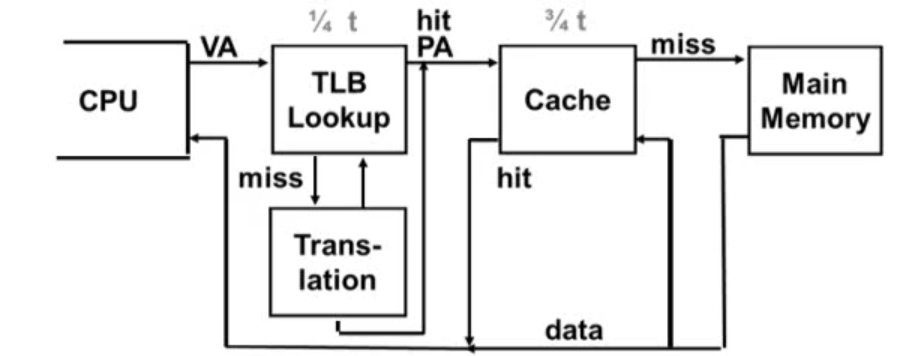
	- A TLB miss - is it a page fault or merely a TLB miss?
		- If the page is loaded into main memory, then the TLB miss can be handled (in hardware or software) by loading the translation information from the page table into the TLB
			- Takes 10's of cycles to find and load the translation info into the TLB
		- If the page is not in main memory, then it's a true page fault
			- Takes 1,000,000's of cycles to service a page fault
	- TLB misses are much more frequent than true page faults

- Fast Translation Using a TLB
	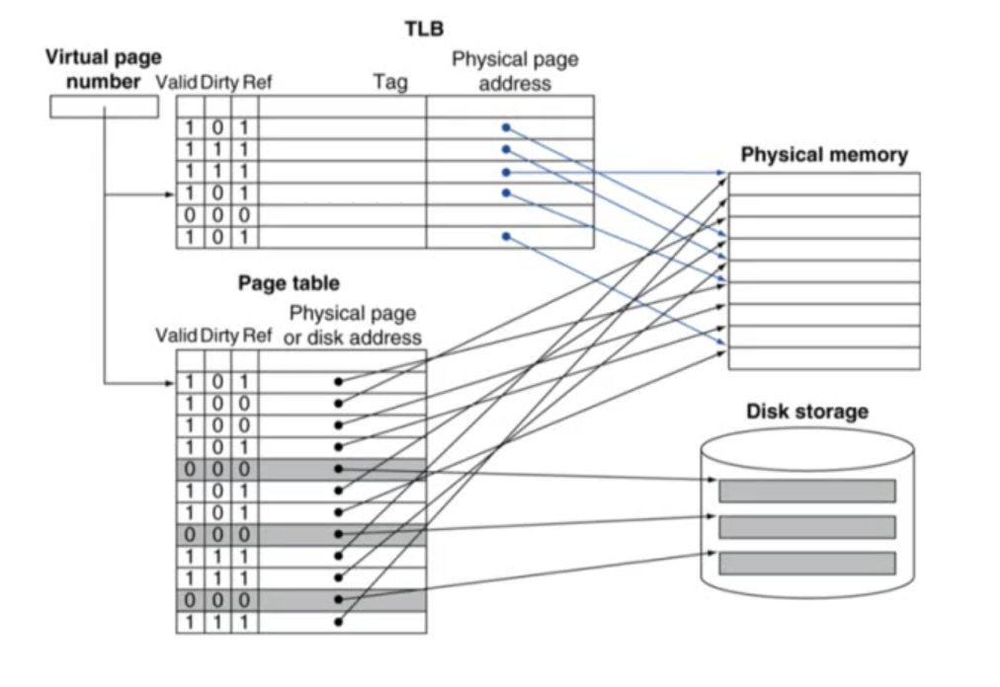

- TLB Misses
	- If page is in memory
		- Load the PTE from memory and retry
		- Could be handled in hardware
			- Can get complex for more complicated page table structures
		- Or in software
			- Raise a special exception, with optimized handler
	- If page is not in memory (page fault)
		- OS handles fetchiing the page and updating the page table
		- Then restart the faulting instruction

- TLB Miss Handler
	- TLB miss indicates
		- Page present, but PTE not in TLB
		- Page not preset
	- Must recognize TLB miss before destination register overwritten
		- Raise exception
	- Handler copies PTE from memory to TLB
		- Then restarts instruction
		- If page not present, page fault will occur

- Page Fault Handler
	- Use faulting virtual address to find PTE
	- Locate page on disk
	- Choose page to replace
		- If dirty, write to disk first
	- Read page into memory and update page table
	- Make process runnable again
		- Restart from faulting instruction

- TLB and Cache Interaction
	- If cache tag uses physical address
		- Need to translate before cache lookup
	- Alternative: use virtual address tag
		- Complications due to aliasing
			- Different virtual addresses for shared physical address
	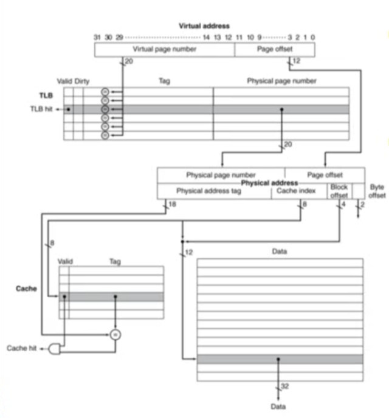

- Memory Protection
	- Different tasks can share parts of their virtual address spaces
		- But need to protect against errant access
		- Requires OS assistance
	- Hardware support for OS protection
		- Privileged supervisor mode (aka kernel mode)
		- Privileged instructions
		- Page tables and other state information only accessible in supervisor mode
		- System call exception (e.g., syscall in MIPS)
