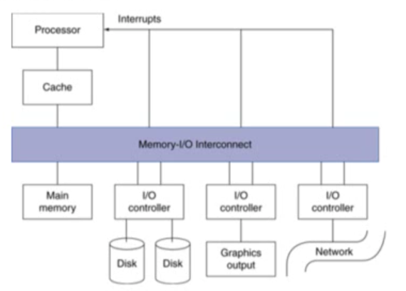
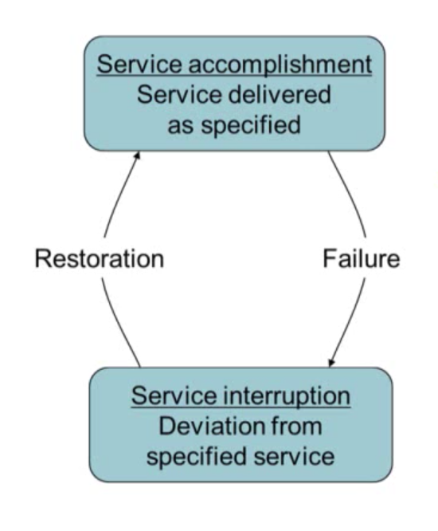
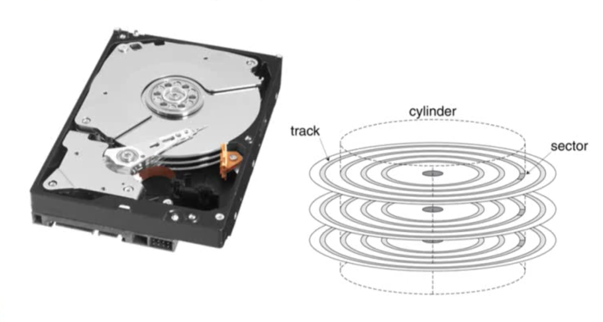
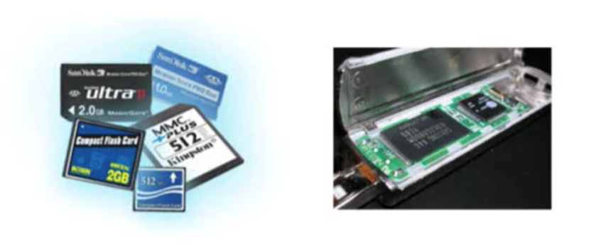
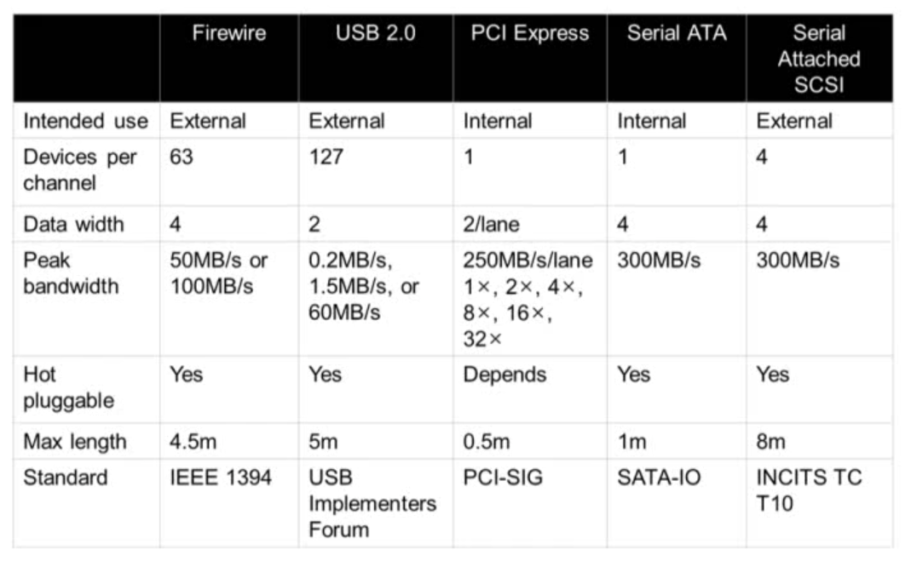
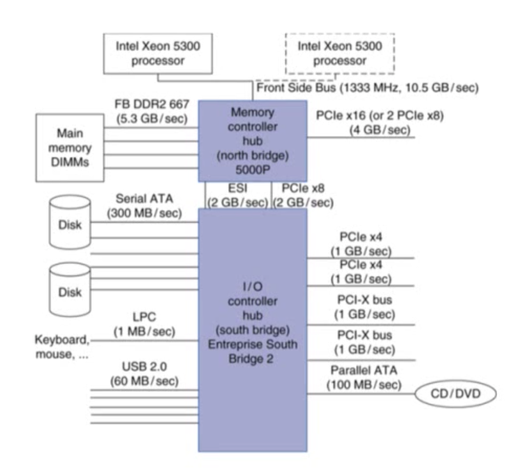

> 본 글은 영남대학교 최규상 교수님의 [컴퓨터 구조](http://www.kocw.net/home/cview.do?cid=184062fa9a833237) 강의를 듣고 작성된 글입니다.

### 6.1 Introduction

- Introduction
	- I/O devices can be characterized by
		- Behaviour: input, output, storage
		- Partner: human or machine
		- Data rate: bytes/sec, transfers/sec
	- I/O bus connections
	

- I/O System Characteristics
	- Dependablility is important
		- Particularly for storage devices
	- Performance measures
		- Latency (response time)
		- Throughput (bandwidth)
		- Desktops & embedded systems
			- Mainly interested in response time & diversity of devices
		- Servers
			- Mainly interested in throughput & expandability of devcies

### 6.2 Dependability, Reliability, and Availability

- Dependability
	
	- Fault: failure of a component
		- May or may not lead to system failure

- Dependability Measures
	- Reliability: mean time to failure (MTTF)
	- Service interruption: mean time to repair (MTTR)
	- Mean time between failures
		- MTBF = MTTF + MTTR
	- Availability = MTTF / (MTTF + MTTR)
	- Improving Availability
		- Increase MTTF: fault avoidance, fault tolerance, fault forecasting
		- Reduce MTTR: improved tools and processes for diagnosis and repair

### 6.3 Disk Storage

- Disk Storage
	- Nonvolatile, rotating magnetic storage
	

- Disk Sectors and Access
	- Each sector records
		- Sector ID
		- Data (512 bytes, 4096 bytes proposed)
		- Error correcting code (ECC)
			- Used to hide defects and recording errors
		- Synchronization fields and gaps
	- Access to a sector involves
		- Queuing delay if other accesses are pending
		- Seek: move the heads
		- Rotational latency
		- Data transfer
		- Controller overhead

- Disk Access Example
	- Given
		- 512B sector, 15,000rpm, 4ms average seek time, 100MB/s transfer rate, 0.2ms controller overhead, idle disk
	- Average read time
		```
		4 ms seek time
		+ (1/2) / (15,000/60) = 2ms rotational latency
		+ 512 / 100MB/s = 0.005ms transfer time
		+ 0.2ms controller delay
		= 6.2ms
		```
	- If actual average seek time is 1ms
		- Average read time = 3.2ms

- Disk Performance Issues
	- Manufacturers quote average seek time
		- Based on all possible seeks
		- Locality and OS scheduling lead to smaller actual avaerage seek times
	- Smart disk controller allocate physical sectors on disk
		- Present logical sector interface to host
		- SCSI, ATA, SATA, SAS
	- Disk drives include caches
		- Prefetch sectors in anticipation of access
		- Avoid seek and rotational delay

### 6.4 Flash Storage

- Flash Storage
	- Nonvolatile semiconductor storage
		- 100 times ~ 1000 times faster than disk
		- Smaller, lower power, more robust
		- But more $/GB (between disk and DRAM)
	

- Flash Types
	- NOR flash: bit cell like a NOR gate
		- Random read/write access
		- Used for instruction memory in embedded systems
	- NAND flash: bit cell like a NAND gate
		- Denser (bits/area), but block-at-a-time access
		- Cheaper per GB
		- Used for USB keys, media storage, ...
	- Flash bits wears out after 10000's of accesses
		- Not suitable for direct RAM or disk replacement
		- Wear leveling: remap data to less used blocks

### 6.5 Connecting Processors, Memory, and I/O Devices

- Interconnecting Components
	- Need interconnections between
		- CPU, memory, I/O controllers
	- Bus: shared communication channel
		- Parallel set of wires for data and synchronization of data transfer
		- Can become a bottleneck
	- Performance limited by physical factors
		- Wire length, number of connections
	- More recent alternative: high-speed serial connections with switches
		- Like networks

- Bus Types
	- Processor-Memory buses
		- Short, high speed
		- Design is matched to memory organization
	- I/O buses
		- Longer, allowing multiple connections
		- Specified by standards for interoperability
		- Connect to processor-memory bus through a bridge

- Bus Signals and Synchronization
	- Data lines
		- Carry address and data
		- Multiplexed or separate
	- Control lines
		- Indicate data type, synchronize transactions
	- Synchronous
		- Uses a bus clock
	- Asynchronous
		- Uses request/acknowledge control lines for handshaking

- I/O Bus Examples
	

- Typical x86 PC I/O System
	

### 6.6 Interfacing I/O Devices to the Processor, Memory, and Operating System

- I/O Management
	- I/O is mediated by the OS
		- Multiple programs share I/O resources
			- Need protection and scheduling
		- I/O causes asynchronous interrupts
			- Same mechanism as exceptions
		- I/O programming is fiddly
			- OS provides abstractions to programs

- I/O Commands
	- I/O devices are managed by I/O controller hardware
		- Transfers data to/from device
		- Synchronizes operations with software
	- Command registers
		- Cause device to do something
	- Status registers
		- Indicate what the device is doing and occurrence of errors
	- Data registers
		- Write: transfer data to a device
		- Read: transfer data from a device

- I/O Register Mapping
	- Memory mapped I/O
		- Registers are addressed in same space as memory
		- Address decoder distinguishes between them
		- OS uses address translation mechanism to make them only accessible to kernel
	- I/O instructions
		- Seperate instructions to access I/O register
		- Can only be executed in kernel mode
		- Example: x86
		
- Polling
	- Periodically check I/O status register
		- If device ready, do operation
		- If error, take action
	- Common in small or low-performance real-time embedded system
		- Predictable timing
		- Low hardware cost
	- In other systems, wastes CPU time

- Interrupts
	- When a device is ready or error occurs
		- Controller interrupts CPU
	- Interrupt is like an exception
		- But not synchronized to instruction execution
		- Can invoke handler between instructions
		- Cause information often identifies the interrupting device
	- Priority interrupts
		- Devices needing more urgent attention get higher priority
		- Can interrupt handler for a lower priority interrupt
