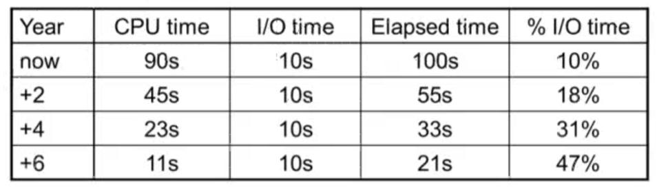
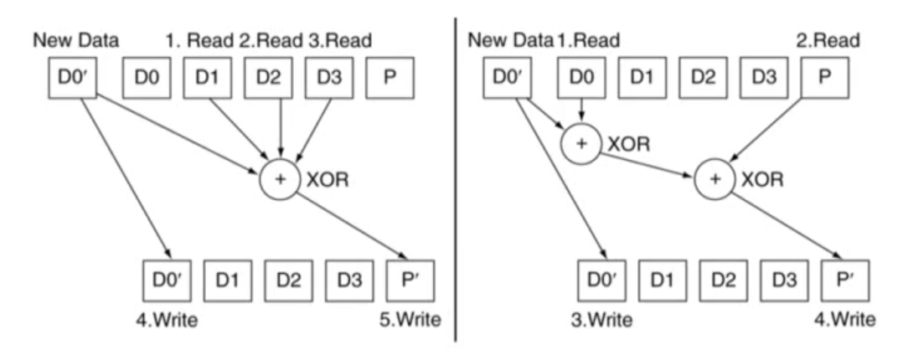
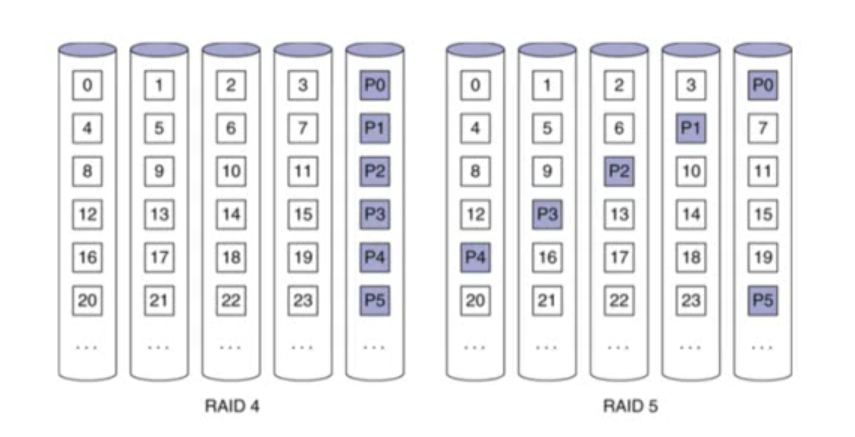

> 본 글은 영남대학교 최규상 교수님의 [컴퓨터 구조](http://www.kocw.net/home/cview.do?cid=184062fa9a833237) 강의를 듣고 작성된 글입니다.

### 6.1 Introduction

- Introduction
	- I/O devices can be characterized by
		- Behaviour: input, output, storage
		- Partner: human or machine
		- Data rate: bytes/sec, transfers/sec
	- I/O bus connections
	

- I/O System Characteristics
	- Dependablility is important
		- Particularly for storage devices
	- Performance measures
		- Latency (response time)
		- Throughput (bandwidth)
		- Desktops & embedded systems
			- Mainly interested in response time & diversity of devices
		- Servers
			- Mainly interested in throughput & expandability of devcies

### 6.2 Dependability, Reliability, and Availability

- Dependability
	
	- Fault: failure of a component
		- May or may not lead to system failure

- Dependability Measures
	- Reliability: mean time to failure (MTTF)
	- Service interruption: mean time to repair (MTTR)
	- Mean time between failures
		- MTBF = MTTF + MTTR
	- Availability = MTTF / (MTTF + MTTR)
	- Improving Availability
		- Increase MTTF: fault avoidance, fault tolerance, fault forecasting
		- Reduce MTTR: improved tools and processes for diagnosis and repair

### 6.3 Disk Storage

- Disk Storage
	- Nonvolatile, rotating magnetic storage
	

- Disk Sectors and Access
	- Each sector records
		- Sector ID
		- Data (512 bytes, 4096 bytes proposed)
		- Error correcting code (ECC)
			- Used to hide defects and recording errors
		- Synchronization fields and gaps
	- Access to a sector involves
		- Queuing delay if other accesses are pending
		- Seek: move the heads
		- Rotational latency
		- Data transfer
		- Controller overhead

- Disk Access Example
	- Given
		- 512B sector, 15,000rpm, 4ms average seek time, 100MB/s transfer rate, 0.2ms controller overhead, idle disk
	- Average read time
		```
		4 ms seek time
		+ (1/2) / (15,000/60) = 2ms rotational latency
		+ 512 / 100MB/s = 0.005ms transfer time
		+ 0.2ms controller delay
		= 6.2ms
		```
	- If actual average seek time is 1ms
		- Average read time = 3.2ms

- Disk Performance Issues
	- Manufacturers quote average seek time
		- Based on all possible seeks
		- Locality and OS scheduling lead to smaller actual avaerage seek times
	- Smart disk controller allocate physical sectors on disk
		- Present logical sector interface to host
		- SCSI, ATA, SATA, SAS
	- Disk drives include caches
		- Prefetch sectors in anticipation of access
		- Avoid seek and rotational delay

### 6.4 Flash Storage

- Flash Storage
	- Nonvolatile semiconductor storage
		- 100 times ~ 1000 times faster than disk
		- Smaller, lower power, more robust
		- But more $/GB (between disk and DRAM)
	

- Flash Types
	- NOR flash: bit cell like a NOR gate
		- Random read/write access
		- Used for instruction memory in embedded systems
	- NAND flash: bit cell like a NAND gate
		- Denser (bits/area), but block-at-a-time access
		- Cheaper per GB
		- Used for USB keys, media storage, ...
	- Flash bits wears out after 10000's of accesses
		- Not suitable for direct RAM or disk replacement
		- Wear leveling: remap data to less used blocks

### 6.5 Connecting Processors, Memory, and I/O Devices

- Interconnecting Components
	- Need interconnections between
		- CPU, memory, I/O controllers
	- Bus: shared communication channel
		- Parallel set of wires for data and synchronization of data transfer
		- Can become a bottleneck
	- Performance limited by physical factors
		- Wire length, number of connections
	- More recent alternative: high-speed serial connections with switches
		- Like networks

- Bus Types
	- Processor-Memory buses
		- Short, high speed
		- Design is matched to memory organization
	- I/O buses
		- Longer, allowing multiple connections
		- Specified by standards for interoperability
		- Connect to processor-memory bus through a bridge

- Bus Signals and Synchronization
	- Data lines
		- Carry address and data
		- Multiplexed or separate
	- Control lines
		- Indicate data type, synchronize transactions
	- Synchronous
		- Uses a bus clock
	- Asynchronous
		- Uses request/acknowledge control lines for handshaking

- I/O Bus Examples
	

- Typical x86 PC I/O System
	

### 6.6 Interfacing I/O Devices to the Processor, Memory, and Operating System

- I/O Management
	- I/O is mediated by the OS
		- Multiple programs share I/O resources
			- Need protection and scheduling
		- I/O causes asynchronous interrupts
			- Same mechanism as exceptions
		- I/O programming is fiddly
			- OS provides abstractions to programs

- I/O Commands
	- I/O devices are managed by I/O controller hardware
		- Transfers data to/from device
		- Synchronizes operations with software
	- Command registers
		- Cause device to do something
	- Status registers
		- Indicate what the device is doing and occurrence of errors
	- Data registers
		- Write: transfer data to a device
		- Read: transfer data from a device

- I/O Register Mapping
	- Memory mapped I/O
		- Registers are addressed in same space as memory
		- Address decoder distinguishes between them
		- OS uses address translation mechanism to make them only accessible to kernel
	- I/O instructions
		- Seperate instructions to access I/O register
		- Can only be executed in kernel mode
		- Example: x86
		
- Polling
	- Periodically check I/O status register
		- If device ready, do operation
		- If error, take action
	- Common in small or low-performance real-time embedded system
		- Predictable timing
		- Low hardware cost
	- In other systems, wastes CPU time

- Interrupts
	- When a device is ready or error occurs
		- Controller interrupts CPU
	- Interrupt is like an exception
		- But not synchronized to instruction execution
		- Can invoke handler between instructions
		- Cause information often identifies the interrupting device
	- Priority interrupts
		- Devices needing more urgent attention get higher priority
		- Can interrupt handler for a lower priority interrupt

- I/O Data Transfer
	- Polling and interrupt-driven I/O
		- CPU transfers data between memory and I/O data registers
		- Time consuming for high-speed devices
	- Direct memory access (DMA)
		- OS provides starting address in memory
		- I/O controller transfers to/from memory autonomously
		- Controller interrupts on completion or error

- DMA/Cache Interaction
	- If DMA writes to a memory block that is cached
		- Cached copy becomes stale
	- If write-back cache has dirty block, and DMA reads memory block
		- Reads stale data
	- Need to ensure cache coherence
		- Flush blocks from cache if they will be used for DMA
		- Or use non-cacheable memory locations for I/O

- DMA/VM Interaction
	- OS uses virtual addresses for memory
		- DMA blocks may not be contiguous in physical memory
	- Should DMA use virtual addresses?
		- Would require controller to do translation
	- If DMA uses physical addresses
		- May need to break transfers into page-sized chunks
		- Or chain multiple transfers
		- Or allocate contiguous physical pages for DMA

### 6.7 I/O Performance Measures: Examples from Disk and File Systems

- Measuring I/O Performance
	- I/O performance depends on
		- Hardware: CPU, memory, controllers, buses
		- Software: operating system, database, management system, application
		- Workload: request rates and patterns
	- I/O system design can trade-off between response time and throughput
		- Measurements of throughput often done with constrained response-time

- Transaction Processing Benchmarks
	- Transactions
		- Small data accesses to a DBMS
		- Interested in I/O rate, not data rate
	- Measure throughput
		- Subject to response time limits and failure handling
		- ACID (Atomicity, Consistency, Isolation, Durability)
		- Overall cost per transaction
	- Transaction Processing Council (TPC) benchmarks (www.tcp.org)
		- TPC-APP: B2B application server and web services
		- TCP-C: on-line order entry environment
		- TCP-E: on-line transaction processing for brokerage firm
		- TPC-H: decision support - buisiness oriented ad-hoc queries

- File System & Web Benchmarks
	- SPEC System File System (SFS)
		- Synthetic workload for NFS server, based on monitoring real systems
		- Results
			- Throughput (operations/sec)
			- Response time (average ms/operation)
	- SPEC Web Server benchmark
		- Measures simultaneous user sessions, subject to required throughput/session
		- Three workloads: Banking. Ecommerce, and Support

- I/O vs. CPU Performance
	- Amdahl's Law
		- Don't neglect I/O performance as parallelism increases compute performance
	- Example
		- Benchmark takes 90s CPU time, 10s I/O time
		- Double the number of CPUs/2 years
			- I/O unchanged
			

### 6.8 Designing an I/O System

- I/O System Design
	- Satisfying latency requirements
		- For time-critical operations
		- If system is unloaded
			- Add up latency of components
	- Maximizing throughput
		- Find "weakest link" (lowest-bandwidth component)
		- Configure to operate at its maximun bandwidth
		- Balance remaining components in the system
	- If system is loaded, simple analysis is insuffcient
		- Need to use queuing models or simulation

### 6.9 Parallelism and I/O: Redundant Arrays of Inexpensive Disks

- RAID
	- Redundant Array of Inexpensive (Independent) Disks
		- Use multiple smaller disks (c.f. one large disk)
		- Parallelism improves performance
		- Plus extra disk(s) for redundant data storage
	- Provides fault tolerant storage system
		- Especially if failed disks can be "hot swapped"
	- RAID 0
		- No redundancy ("AID"?)
			- Just stripe data over multiple disks
		- But it does improve performance

- RAID 1 & 2
	- RAID 1: Mirroring
		- N + N disks, replicate data
			- Write data to both data disk and mirror disk
			- On disk failure, read from mirror
	- RAID 2: Error correcting code (ECC)
		- N + E disks (e.g., 10 + 4)
		- Split data at bit level across N disks
		- Generate E-bit ECC
		- Too complex, not used in practice

- RAID 3: Bit-Interleaved Parity
	- N + 1 disks
		- Data striped across N disks at byte level
		- Redundant disk stores parity
		- Read access
			- Read all disks
		- Write access
			- Generate new parity and access all disks
		- On failure
			- Use parity to reconstruct missing data
	- Not widely used

- RAID 4: Block-Interleaved Parity
	- N + 1 disks
		- Data striped across N disks at block level
		- Redundant disk stores parity for a group of blocks
		- Read access
			- Read only the disk holding the required block
		- Write access
			- Just read disk containing modified block, and parity disk
			- Calculate new parity, update data disk and prity disk
		- On failure
			- Use parity to reconstruct missing data
	- Not widely used

- RAID 3 vs RAID 4
	

- RAID 5: Distributed Parity
	- N + 1 disks
		- Like RAID 4, but parity blocks distributed across disks
			- Avoids parity disk being a bottleneck
	- Widely used
	

- RAID 6: P + Q Redundancy
	- N + 2 disks
		- Like RAID 5, but two lots of parity
		- Greater fault tolerance through more redundancy
	- Multiple RAID
		- More advanced systems give similar fault tolerance with better performance

- RAID Summary
	- RAID can improve performance and availability
		- High availability requires hot swapping
	- Assumes independent disk failures
		- Too bad if the building burns down!
	- See "Hard Disk Performance, Quality and Reliability"
		- http://www.pcguide.com/ref/hdd/perf/index.htm

### 6.10 Real Stuff: Sun Fire x4150 Server

- pass

### 6.12 Fallacies and Pitfalls

- Fallacy: Disk Dependability
	- If a disk manufacturer quotes MTTF as 1,200,000hr (140yr)
		- A disk will work that long
	- Wrong: this is the mean time to failure
		- What is the distribution of failures?
		- What if you have 1000 disks
			- How many will fail per year?
		- `Annual Failure Rate (AFR) = 1000 disks * 8760 hrs/disk / 1200000 hrs/failure = 0.73%`

- Fallacies
	- Disk failure rates are as specified
		- Studies of failure rates in the field
			- Schroeder and Gibson: 2% to 4% vs. 0.6% to 0.8%
			- Pinheiro, et al.: 1.7% (first year) to 8.6% (third year) vs. 1.5%
		- Why?
	- A 1GB/s interconnect transfers 1GB in one sec
		- But what's a GB?
		- For bandwidth, use 1GB = 10^9B
		- For storage, use 1GB = 2^30B = 1.075 * 10^9B
		- So 1GB/sec is 0.93GB in one second
			- About 7% error

- Pitfall: Offloading to I/O Processors
	- Overhead of managing I/O processor request may dominate
		- Quicker to do small operation on the CPU
		- But I/O architecture may prevent that
	- I/O processor may be slower
		- Since it's supposed to be simpler
	- Making it faster makes it into a major system component
		- Might need its own coprocessors!

- Pitfall: Backing Up to Tape
	- Magnetic tape used to have advantages
		- Removable, high capacity
	- Advantages eroded by disk technology developments
	- Makes better sense to replicate data
		- E.g., RAID, remote mirroring

- Fallacy: Disk Scheduling
	- Best to let the OS schedule disk accesses
		- But mordern drives deal with logical block addresses
			- Map to physical track, cylinder, sector locations
			- Also, blocks are cached by the drive
		- OS is unaware of physical locations
			- Reordering can reduce performance
			- Depending on placement and caching

- Pitfall: Peak Performance
	- Peak I/O rates are nearly impossible to achieve
		- Usually, some other system component limits performance
		- E.g., transfers to memory over a bus
			- Collision with DRAM refresh
			- Arbitration contention with other bus masters
		- E.g., PCI bus: peak bandwithd ~ 133 MB/sec
			- In practice, max 80MB/sec sustainable

### 6.13 Concluding Remarks

- Concluding Remarks
	- I/O performance measures
		- Throughput, response time
		- Dependability and cost also important
	- Buses used to connect CPU, memory, I/O controllers
		- Polling, interrupts, DMA
	- I/O benchmarks
		- TPC, SPECSFS, SPECWeb
	- RAID
		- Improves performance and dependability