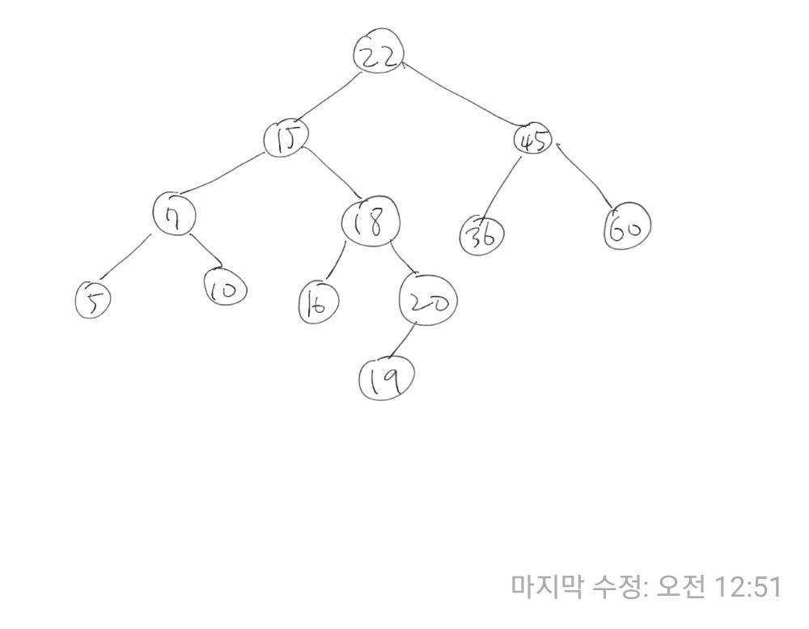

### 이진 탐색 트리

이진 탐색 트리는 다음과 같은 속성이 있는 이진 트리 자료 구조이다.

- 각 노드에 값이 있다.
- 중복된 값을 갖는 노드는 없다.
- 값들은 순서를 가진다.
- 노드의 왼쪽 서브트리에는 그 노드의 값보다 작은 값들을 지닌 노드들로 이루어져 있다.
- 노드의 오른쪽 서브트리에는 그 노드의 값보다 큰 값들을 지닌 노드들로 이루어져 있다.
- 좌우 하위 트리는 각각 다시 이진 탐색트리여야 한다.(즉, 좌우 하위 트리 또한 위 규칙들을 지켜야 한다.)

이진 탐색 트리를 순회할 때는 중위순회를 방식을 사용한다. 왼쪽 자식, 본인, 오른쪽 자식 순으로 읽어나가면 된다.



ArrayList는 탐색은 O(1)로 빠르지만 삽입, 삭제의 경우 재정렬하는데 O(n)의 복잡도가 들기 때문에 비효율적이다. LinkedList는 삽입, 삭제의 경우 O(1)의 복잡도로 빠르지만, 탐색이 O(n)으로 비효율적이다. 이진 탐색 트리는 탐색과 삽입, 삭제 모두 O(logN)의 복잡도로 탐색과 삽입, 삭제 두 마리 토끼를 모두 잡기 위해 등장했다.

하지만 O(logN)의 복잡도를 가지는 경우는 균등한 트리를 이룰 때 이야기이다. 최악의 경우 한쪽으로 편향된 리스트와 같은 형태를 띄는 트리가 될 수 있는데, 이 때는 O(n)의 복잡도를 가지게 된다. 이를 해결하기 위해 AVL Tree, 레드-블랙 트리가 등장하게 된다.

이진 트리 탐색에서는 검색, 삽입, 삭제 이 세 가지 동작이 핵심이다.

### 이진 탐색 트리 검색

찾고자하는 값을 루트노드 부터 비교하면서 내려간다. 비교하는 노드보다 찾고자하는 값이 더 작으면 왼쪽 자식노드로 더 크면 오른쪽 자식노드로 이동한다. 만약 비교하는 노드가 찾고자하는 값과 같다면 true를 리턴한다.

### 이진 탐색 트리 삽입

이진 탐색 트리 검색과 비슷하다. 루트노드부터 비교하면서 자리를 찾아간다. 비교하는 노드보다 삽입하려는 값이 더 작으면 왼쪽 더 크면 오른쪽 자식노드로 이동한다. 이동하고자하는 방향에 자식노드가 존재하지 않으면 해당자리에 삽입하고자하는 값을 넣는다.

### 이진 탐색 트리 삭제

삭제하려는 노드의 자식의 수에 따라 다음과 같은 규칙을 따른다

- 자식노드가 없는 노드(리프 노드): 해당 노드를 삭제한다.(자바에는 객체를 반환할 수 없으므로 부모 노드와의 연결을 끊어주면 된다.)
- 자식노드가 1개인 노드 삭제: 해당 노드를 삭제하고 그 위치에 자식노드를 대입한다.
- 자식노드가 2개인 노드 삭제: 중위 순회 방식으로 값을 늘어 놓았을 때(정렬된 상태로 값을 나열했을 때) 삭제하고자 하는 값의 좌, 우에 존재하는 값으로 삭제하고자 하는 값의 노드를 대체하면 된다.(삭제하고자 하는 노드는 삭제) 삭제하고자 하는 값의 좌, 우에 존재하는 값은 다음과 같은 위치에 존재한다. - 삭제하고자하는 값의 좌측 값: 삭제하고자하는 노드를 기준으로 왼쪽 서브트리에서 가장 큰 값을 가지는 노드. 해당 노드는 서브트리에서 오른쪽 방향으로 끝까지 내려가면 구할 수 있다. - 삭제하고자하는 값의 우측 값: 삭제하고자하는 노드를 기준으로 오른쪽 서브트리에서 가장 작은 값을 가지는 노드. 해당 노드는 서브트리에서 왼쪽 방향으로 끝까지 내려가면 구할 수 있다.

### 이진 탐색 트리 구현하기

삭제의 경우 코드가 좀 더럽게 되었다. 하지만 잘 동작하기도하고 시간관계상 일단 이대로 두기로 한다.

이진 탐색 트리의 검색, 삽입, 삭제를 구현했다. 코드에 대한 설명은 코드 내 주석으로 대체한다.

```java
class MyBinarySearchTree {
	Node root;
	
	public MyBinarySearchTree() {
		root = null;
	}
	
	// 값이 존재하는지 확인한다.
	public boolean find(int target) {
		Node targetNode = findNode(target);
		if(targetNode == null) return false;
		return true;
	}
	
	// 해당 값을 가지는 노드를 반환한다.
	private Node findNode(int target) {
		Node currentNode = root;
		while(currentNode != null) {
			if(currentNode.data > target) {
				currentNode = currentNode.left;
			}else if(currentNode.data < target) {
				currentNode = currentNode.right;
			}else {
				return currentNode;
			}
		}
		return null;
	}
	
	// 삽입 메소드
	public boolean insert(int data) {
		// 값은 중복될 수 없으므로 이미 존재한다면 false를 리턴한다.
		if(find(data)) {
			return false;
		}
		
		Node newNode = new Node(data);
		
		// 아직 트리에 값이 없으면 루트에 해당 값을 넣는다.
		if(root == null) {
			root = newNode;
			return true;
		}
		
		// 값이 들어갈 자리를 찾는다.
		Node parentNode = null;
		Node currentNode = root;
		while(currentNode != null) {
			parentNode = currentNode;
			if(currentNode.data > data) {
				currentNode = currentNode.left;
			}else {
				currentNode = currentNode.right;
			}
		}
		
		// 부모노드보다 작으면 왼쪽 크면 오른쪽에 새로운 노드를 위치한다.
		if(parentNode.data > data) {
			parentNode.left = newNode;
		}else {
			parentNode.right = newNode;
		}
		
		return true;
	}
	
	// 삭제 메소드
	public boolean delete(int data) {
		// 삭제하려는 노드와 부모노드를 찾는다.
		Node parentNode = null;
		Node currentNode = root;
		int direction = 0;
		while(currentNode != null) {
			if(currentNode.data > data) {
				parentNode = currentNode;
				currentNode = currentNode.left;
				direction = 0;
			}else if(currentNode.data < data) {
				parentNode = currentNode;
				currentNode = currentNode.right;
				direction = 1;
			}else {
				break;
			}
		}
		// 삭제하려는 값이 없으면 false를 리턴한다.
		if(currentNode == null) {
			return false;
		}
		
		// 삭제하려는 노드의 자식이 없는 경우.
		if(currentNode.left == null && currentNode.right == null) {
			// 그냥 해당 노드를 삭제한다. 루트일 경우 부모노드가 없기 때문에 별도의 처리를 해준다.
			if(currentNode == root) {
				root = null;
			}else if(direction == 0) {
				parentNode.left = null;
			}else if(direction == 1) {
				parentNode.right = null;
			}
		}else if(currentNode.left != null && currentNode.right == null) {
			// 삭제하려는 노드의 왼쪽 자식이 있는 경우
			// 왼쪽 자식을 삭제하려는 노드의 부모와 연결해준다. 루트는 부모노드가 없기 때문에 별도로 처리 해준다.
			if(currentNode == root) {
				root = currentNode.left;
			}else if(direction == 0) {
				parentNode.left = currentNode.left;
			}else if(direction == 1) {
				parentNode.right = currentNode.left;
			}
		}else if(currentNode.left == null && currentNode.right != null) {
			// 삭제하려는 노드의 오른쪽 자식이 있는 경우
			// 오른쪽 자식을 삭제하려는 노드의 부모와 연결해준다. 루트는 부모노드가 없기 때문에 별도로 처리해준다.
			if(currentNode == root) {
				root = currentNode.right;
			}else if(direction == 0) {
				parentNode.left = currentNode.right;
			}else if(direction == 1) {
				parentNode.right = currentNode.right;
			}
		}else {
			// 삭제하려는 노드의 양 쪽에 모두 자식이 있는 경우. 여기서는 삭제하려는 값보다 작은 값들 중 최댓값으로 삭제하려는 노드를 대체해준다(왼쪽 서브트리에서 가장 큰 값).

			// 왼쪽 서브트리에서
			Node targetNode = currentNode.left;
			// 제일 큰 값을 찾는다.
			while(targetNode.right != null) {
				targetNode = targetNode.right;
			}
			// 왼쪽 서브트리에서 제일 큰 값은 원래 위치에서 삭제한다.
			// 참고로 이진 탐색 트리 특성상 왼쪽 서브트리에서 가장 큰 값과 오른쪽 서브트리에서 가장 작은 값은 자식노드가 없거나 한 개이다. 따라서 재귀 호출이 2번 이상 일어나지 않으므로 스택오버플로우는 걱정할 필요가 없다.
			delete(targetNode.data);
			// 왼쪽 서브트리에서 제일 큰 값을 삭제하려는 노드 위치에 넣어준다.
			// 부모 노드와 연결
			if(currentNode == root) {
				root = targetNode;
			}else if(direction == 0) {
				parentNode.left = targetNode;
			}else if(direction == 1) {
				parentNode.right = targetNode;
			}
			// 자식 노드들과 연결
			// 왼쪽 서브트리에 노드가 하나만 있는 경우 삭제하려는 노드의 왼쪽 자식 노드와 왼쪽 서브트리에서 가장 큰 값은 동일한 노드가 된다. 자기 자신은 자식으로 가지면 안되기 때문에 예외처리를 해준다.
			if(targetNode != currentNode.left) {
				targetNode.left = currentNode.left;
			}
			targetNode.right = currentNode.right;
		}
		
		return true;
	}
	
	// 노드 클래스
	class Node {
		Node left;
		Node right;
		int data;
		
		Node(int data) {
			this.data = data;
			left = null;
			right = null;
		}
	}
}
```

잘 돌아가는지 테스트를 해보기위해 도움이 될만한 메소드들을 몇 가지 구현했다. 중위 순회로 노드들을 나열하는 메소드, 삽입, 삭제 후 출력하는 메소드등 혹시 필요하다면 아래코드를 사용하자.

```java
public class Main {
  public static void main(String[] args) {
	  MyBinarySearchTree bst = new MyBinarySearchTree();
	  bst.insertAndPrint(22);
	  bst.insertAndPrint(15);
	  bst.insertAndPrint(45);
	  bst.insertAndPrint(7);
	  bst.insertAndPrint(18);
	  bst.insertAndPrint(5);
	  bst.insertAndPrint(10);
	  bst.insertAndPrint(16);
	  bst.insertAndPrint(20);
	  bst.insertAndPrint(19);
	  bst.insertAndPrint(36);
	  bst.insertAndPrint(60);
	  bst.insertAndPrint(18); // fail case
	  System.out.println("");
	  System.out.println("");

	  bst.deleteAndPrint(5);
	  bst.deleteAndPrint(5); // fail case
	  bst.insertAndPrint(5);
	  System.out.println("");

	  bst.deleteAndPrint(7);
	  bst.insertAndPrint(7);
	  System.out.println("");

	  bst.deleteAndPrint(10);
	  bst.insertAndPrint(10);
	  System.out.println("");

	  bst.deleteAndPrint(15);
	  bst.insertAndPrint(15);
	  System.out.println("");

	  bst.deleteAndPrint(16);
	  bst.insertAndPrint(16);
	  System.out.println("");

	  bst.deleteAndPrint(18);
	  bst.insertAndPrint(18);
	  System.out.println("");

	  bst.deleteAndPrint(19);
	  bst.insertAndPrint(19);
	  System.out.println("");

	  bst.deleteAndPrint(20);
	  bst.insertAndPrint(20);
	  System.out.println("");

	  bst.deleteAndPrint(22);
	  bst.insertAndPrint(22);
	  System.out.println("");

	  bst.deleteAndPrint(36);
	  bst.insertAndPrint(36);
	  System.out.println("");

	  bst.deleteAndPrint(45);
	  bst.insertAndPrint(45);
	  System.out.println("");

	  bst.deleteAndPrint(60);
	  bst.insertAndPrint(60);
	  System.out.println("");

	  bst.deleteAndPrint(60);
	  bst.deleteAndPrint(16);
	  bst.deleteAndPrint(45);
	  bst.deleteAndPrint(5);
	  bst.deleteAndPrint(22);
	  bst.deleteAndPrint(10);
	  bst.deleteAndPrint(15);
	  bst.deleteAndPrint(23); // fail case
	  bst.deleteAndPrint(18);
	  bst.deleteAndPrint(19);
	  bst.deleteAndPrint(36);
	  bst.deleteAndPrint(20);
	  bst.deleteAndPrint(7);
  }
}

class MyBinarySearchTree {
	Node root;

	public MyBinarySearchTree() {
		root = null;
	}

	public boolean find(int target) {
		Node targetNode = findNode(target);
		if(targetNode == null) return false;
		return true;
	}

	private Node findNode(int target) {
		Node currentNode = root;
		while(currentNode != null) {
			if(currentNode.data > target) {
				currentNode = currentNode.left;
			}else if(currentNode.data < target) {
				currentNode = currentNode.right;
			}else {
				return currentNode;
			}
		}
		return null;
	}

	public boolean insert(int data) {
		if(find(data)) {
			return false;
		}

		Node newNode = new Node(data);

		if(root == null) {
			root = newNode;
			return true;
		}

		Node parentNode = null;
		Node currentNode = root;
		while(currentNode != null) {
			parentNode = currentNode;
			if(currentNode.data > data) {
				currentNode = currentNode.left;
			}else {
				currentNode = currentNode.right;
			}
		}

		if(parentNode.data > data) {
			parentNode.left = newNode;
		}else {
			parentNode.right = newNode;
		}

		return true;
	}

	public void insertAndPrint(int data) {
		if(insert(data)) {
			print();
		}else {
			System.out.println("insertion fail");
		}
	}

	public boolean delete(int data) {
		Node parentNode = null;
		Node currentNode = root;
		int direction = 0;
		while(currentNode != null) {
			if(currentNode.data > data) {
				parentNode = currentNode;
				currentNode = currentNode.left;
				direction = 0;
			}else if(currentNode.data < data) {
				parentNode = currentNode;
				currentNode = currentNode.right;
				direction = 1;
			}else {
				break;
			}
		}
		if(currentNode == null) {
			return false;
		}

		if(currentNode.left == null && currentNode.right == null) {
			if(currentNode == root) {
				root = null;
			}else if(direction == 0) {
				parentNode.left = null;
			}else if(direction == 1) {
				parentNode.right = null;
			}
		}else if(currentNode.left != null && currentNode.right == null) {
			if(currentNode == root) {
				root = currentNode.left;
			}else if(direction == 0) {
				parentNode.left = currentNode.left;
			}else if(direction == 1) {
				parentNode.right = currentNode.left;
			}
		}else if(currentNode.left == null && currentNode.right != null) {
			if(currentNode == root) {
				root = currentNode.right;
			}else if(direction == 0) {
				parentNode.left = currentNode.right;
			}else if(direction == 1) {
				parentNode.right = currentNode.right;
			}
		}else {
			Node targetNode = currentNode.left;
			while(targetNode.right != null) {
				targetNode = targetNode.right;
			}
			delete(targetNode.data);
			if(currentNode == root) {
				root = targetNode;
			}else if(direction == 0) {
				parentNode.left = targetNode;
			}else if(direction == 1) {
				parentNode.right = targetNode;
			}
			if(targetNode != currentNode.left) {
				targetNode.left = currentNode.left;
			}
			targetNode.right = currentNode.right;
		}

		return true;
	}

	public void deleteAndPrint(int data) {
		if(delete(data)) {
			print();
		}else {
			System.out.println("delete fail");
		}
	}

	public void print() {
		if(root != null) {
			inorderPrint(root);
			System.out.println("");
		}else {
			System.out.println("Tree is empty. Insert data.");
		}
	}

	public void inorderPrint(Node node) {
		if(node.left != null) {
			inorderPrint(node.left);
		}
		System.out.print(node.data + " ");
		if(node.right != null) {
			inorderPrint(node.right);
		}
	}

	class Node {
		Node left;
		Node right;
		int data;

		Node(int data) {
			this.data = data;
			left = null;
			right = null;
		}
	}
}
```

### 참고

- [이진 탐색 트리(위키 백과)](https://ko.wikipedia.org/wiki/%EC%9D%B4%EC%A7%84_%ED%83%90%EC%83%89_%ED%8A%B8%EB%A6%AC)
- [이진 탐색 트리 - ratsgo's blog](https://ratsgo.github.io/data%20structure&algorithm/2017/10/22/bst/)
