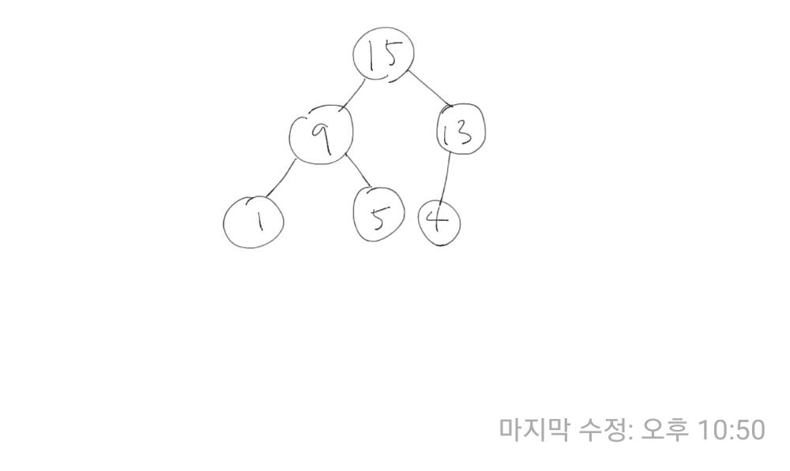
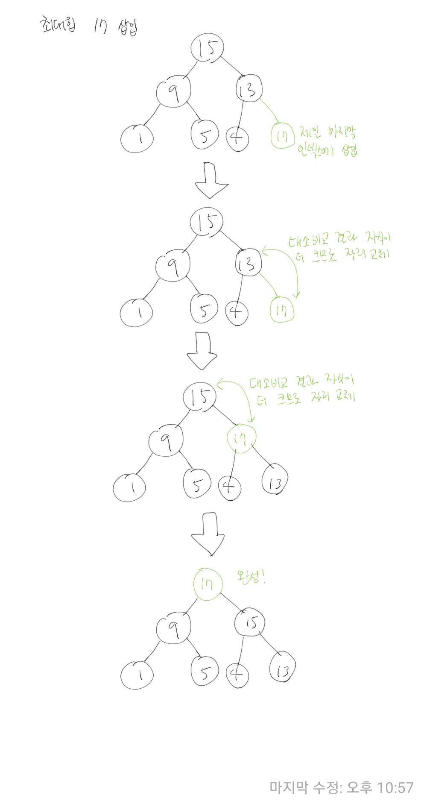
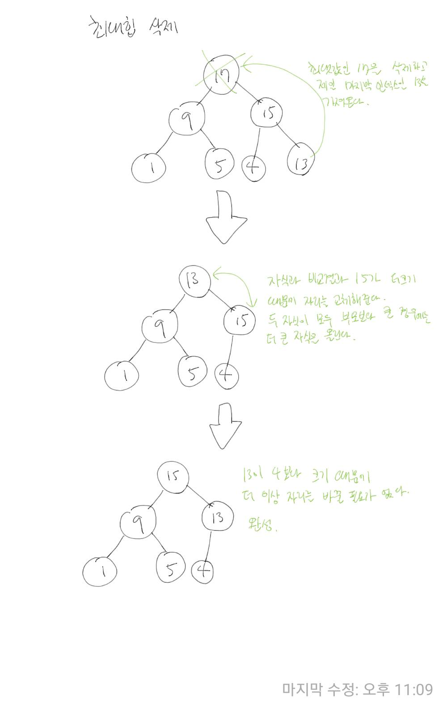

### 힙

힙은 부모의 값이 자식의 값보다 항상 크거나 작은 완전이진트리이다. 이 때, 부모의 값이 자식의 값보다 항상 큰 힙을 '최대 힙', 부모의 값이 자식의 값보다 항상 작은 힙을 '최소 힙'이라고 한다.



키값의 대소관계는 오로지 부모노드와 자식노드 간에만 성립하며, 형제 사이에는 성립하지 않는다.

힙을 활용하여 우선순위 큐를 구현하거나 힙 정렬을 만드는 등의 일을 할 수 있다.

힙은 항상 부모 자식 간에 대소관계를 유지해야하기 떄문에 삽입, 삭제마다 정렬을 해줘야한다. 그 과정을 최대힙을 통해서 알아보자.

### 힙의 삽입



### 힙의 삭제



### 힙 구현하기

int 값을 저장하는 최대힙을 배열로 구현해보자. 아래 코드는 몇 가지 약속을 바탕으로 구현되었는데 그 약속은 다음과 같다.

- 계산의 편의를 위해 배열의 0번 인덱스는 사용하지 않는다.
- 부모의 인덱스가 i 일 때, 자식의 인덱스는 2 * i, 2 * i + 1이다.

위 약속을 바탕으로 최대힙에 데이터를 삽입하는 add() 메소드와 데이터를 제거하는 remove() 메소드를 구현해보자.

```java
class MyMaxHeap {
	int[] array;
	int lastIndex;

	public MyMaxHeap(int size) {
		array = new int[size + 1];
		lastIndex = 0;
	}

	private void swap(int index1, int index2) {
		int temp = array[index1];
		array[index1] = array[index2];
		array[index2] = temp;
	}

	public void add(int e) {
		array[++lastIndex] = e;

		int i = lastIndex;

		while(i > 1) {
			if(array[i / 2] < array[i]) {
				swap(i / 2, i);
				i = i / 2;
			}else {
				break;
			}
		}
	}

	public int remove() {
		int returnValue = array[1];

		array[1] = array[lastIndex];
		array[lastIndex--] = 0;
		int i = 1;
		while(i * 2 <= lastIndex || i * 2 + 1 <= lastIndex) {
			if(array[i] < array[i * 2 + 1] || array[i] < array[i * 2 ]) {
				int biggerChild = array[i * 2 + 1] > array[i * 2] ? i * 2 + 1 : i * 2;
				swap(i, biggerChild);
				i = biggerChild;
			}else {
				break;
			}
		}

		return returnValue;
	}
}
```

### 참고

- [합(위키 백과)](<https://ko.wikipedia.org/wiki/%ED%9E%99_(%EC%9E%90%EB%A3%8C_%EA%B5%AC%EC%A1%B0)>)
- [[자료구조] 힙(heap)이란](https://gmlwjd9405.github.io/2018/05/10/data-structure-heap.html)