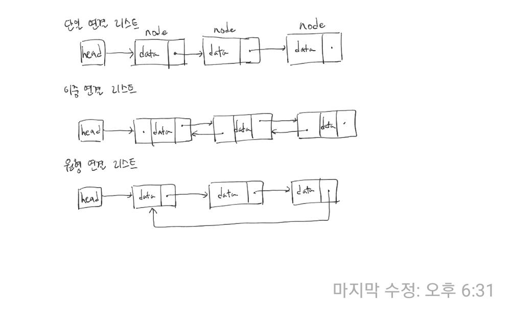

### 연결 리스트

연결 리스트, 링크드 리스트(Linked List)는 각 노드가 데이터와 포인터를 가지고 한 줄로 연결되어 있는 방식으로 데이터를 저장하는 자료구조이다. 이름에서 말하듯이 데이터를 담고 있는 노드들이 연결되어 있는데, 노드의 포인터가 다음이나 이전의 노드와의 연결을 담당하게 된다.

포인터가 존재하지 않는 자바의 경우 레퍼런스를 활용해서 구현할 수 있다.

연결 리스트는 중간지점에서 자료를 추가 삭제하는데 O(1)의 시간에 가능하다는 장점이 있다. 하지만 배열이나 트리와 달리 특정 위치에서 자료를 탐색하는데에는 O(n)의 시간이 걸리는 단점이 있다. 따라서 연결 리스트는 자료 탐색보다는 추가, 삭제가 빈번하게 일어나는 경우 더 효율적이라고 볼 수 있다.

### 연결 리스트의 종류



#### 단일 연결 리스트

단일 연결 리스트는 각 노드에 데이터와 하나의 포인터 공간이 있고 각 노드의 포인터는 다음 노드를 가리킨다.

#### 이중 연결 리스트

이중 연결 리스트는 각 노드에 데이터와 두 개의 포인터 공간이 있고 각 노드의 포인터 공간은 이전 노드와 다음 노드를 가리킨다.

#### 원형 연결 리스트

원형 연결 리스트는 단일 연결 리스트에서 마지막 노드를 처음 노드와 연결시켜준 것으로 마지막 노드의 포인터 공간이 처음 노드를 가리킨다.

### 연결 리스트 구현하기

여기서는 제일 기초적인 단일 연결 리스트를 구현해보자. 우리가 구현할 메소드는 다음과 같다
- addFirst(E data): 데이터를 연결 리스트 제일 앞에 추가한다.
- addLast(E data): 데이터를 연결 리스트 제일 마지막에 추가한다.
- removeFirst(): 연결 리스트의 첫 번째 데이터를 제거한다.
- removeLast(): 연결 리스트의 마지막 데이터를 제거한다.
- reverse(): 연결 리스트를 뒤집는다.

```java
class MyLinkedList<E> {
	private Node<E> head;

	public MyLinkedList() {
		this.head = null;
	}

	public void addFirst(E data) {
		Node<E> next = head;
		head = new Node<E>(data, next);
	}

	public void addLast(E data) {
		if(head == null) {
			head = new Node<E>(data, null);
			return;
		}
		Node<E> ptr = head;
		while(ptr.next != null) {
			ptr = ptr.next;
		}
		ptr.next = new Node<E>(data, null);
	}

	public void removeFirst() {
		if(head == null) {
			return;
		}
		head = head.next;
	}

	public void removeLast() {
		if(head == null) {
			return;
		}
		if(head.next == null) {
			removeFirst();
			return;
		}
		Node<E> ptr = head;
		Node<E> pre = null;
		while(ptr.next != null) {
			pre = ptr;
			ptr = ptr.next;
		}
		pre.next = null;
	}

	public void reverse() {
		if(head == null) return;
		Node<E> pre = null;
		Node<E> current = head;
		Node<E> next = head.next;

		while(current.next != null) {
			current.next = pre;
			pre = current;
			current = next;
			next = current.next;
		}

		current.next = pre;
		head = current;
	}

	class Node<E> {
		private E data;
		private Node<E> next;

		Node(E data, Node<E> next) {
			this.data = data;
			this.next = next;
		}
	}
}
```

### 참고

- [연결 리스트(위키 백과)](https://ko.wikipedia.org/wiki/%EC%97%B0%EA%B2%B0_%EB%A6%AC%EC%8A%A4%ED%8A%B8)
- [자료구조와 함께 배우는 알고리즘 입문 (자바편)](http://www.yes24.com/Product/Goods/60547893)
